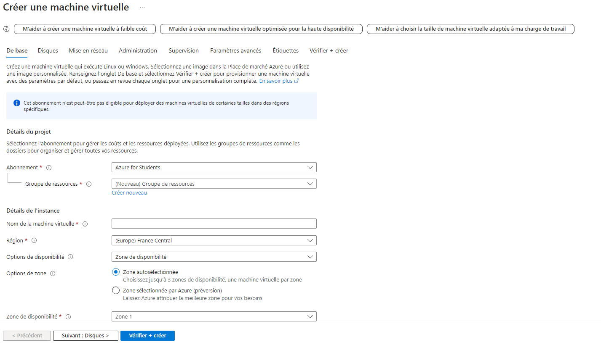
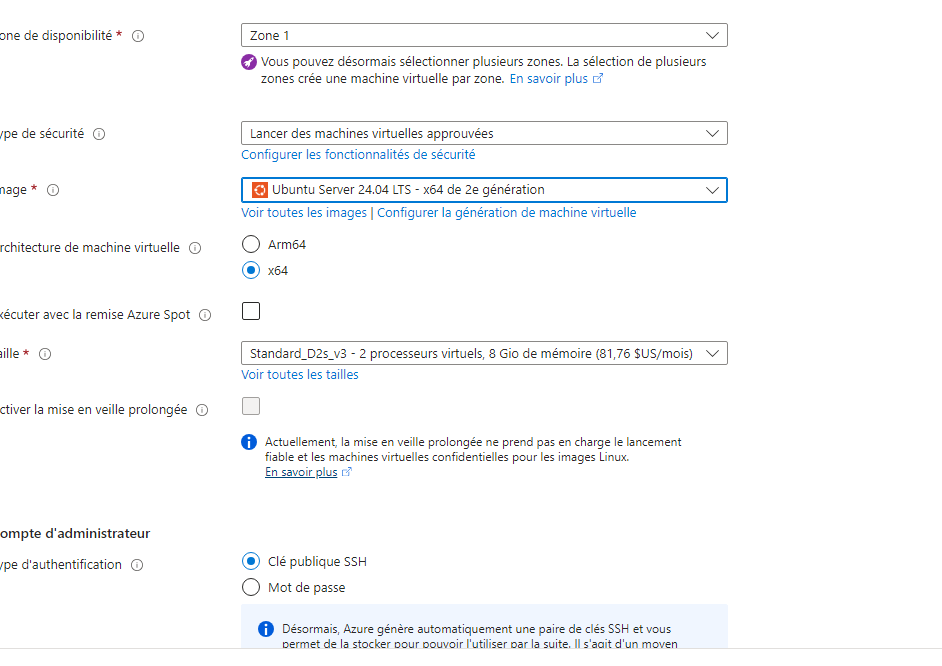
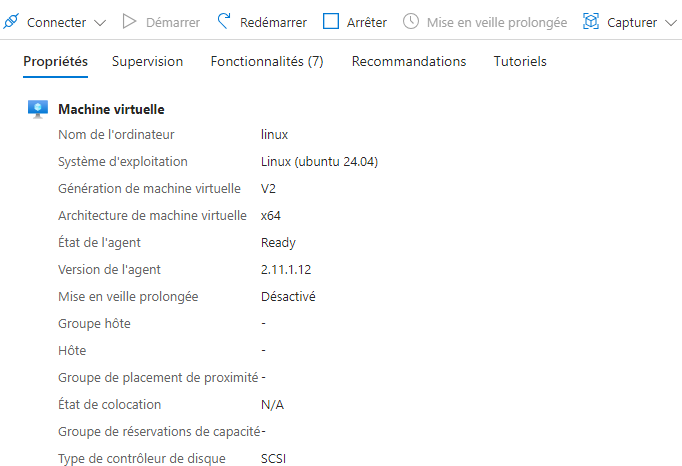
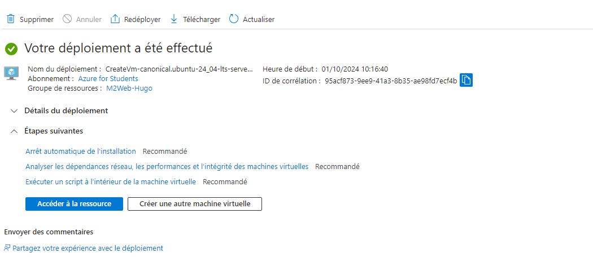
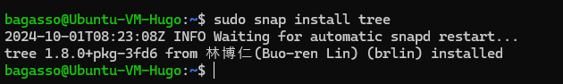
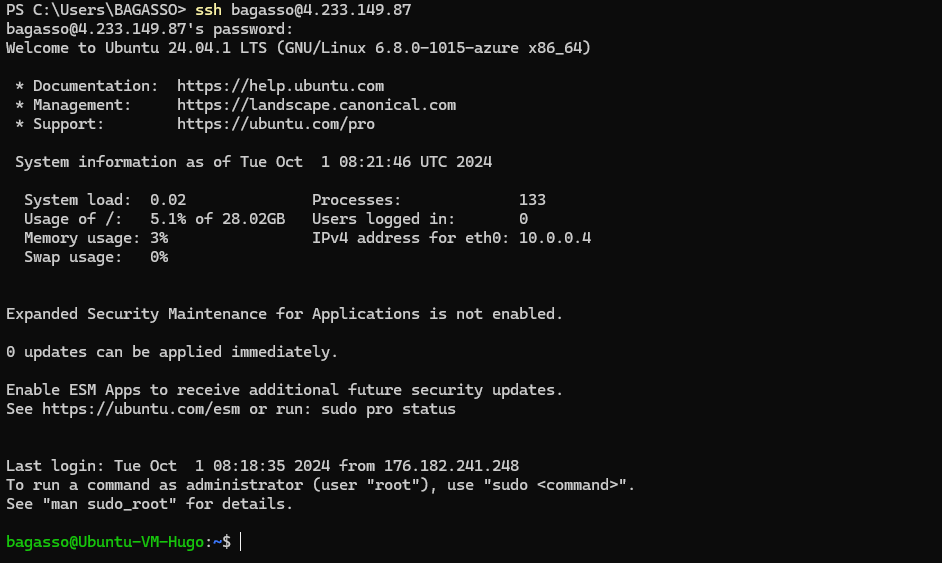

# Lab 1: Creating and Managing Azure Virtual Machines (Linux)

### Interface Azure








### Équivalent en Azure CLI

```bash
az vm create \
  --resource-group <VotreGroupeDeRessources> \
  --name <VotreNomDeVM> \
  --image UbuntuLTS \
  --admin-username <VotreNomUtilisateur> \
  --admin-password '<VotreMotDePasse>' \
  --size Standard_D2s_v3 \
  --public-ip-sku Standard
