# Lab 10: Configuring Azure Backup and Recovery Services

## 1. Create a Recovery Services Vault

### Azure Portal
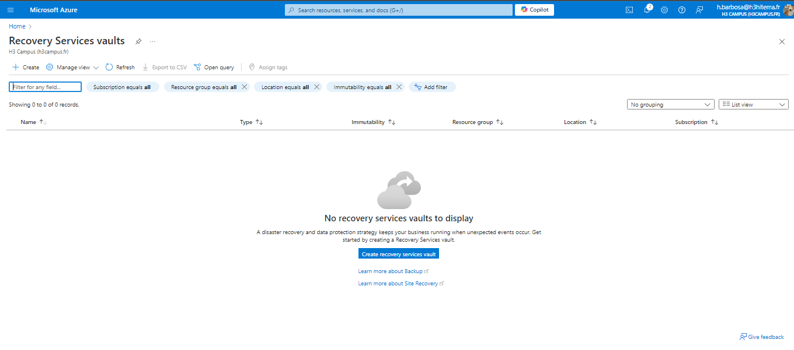
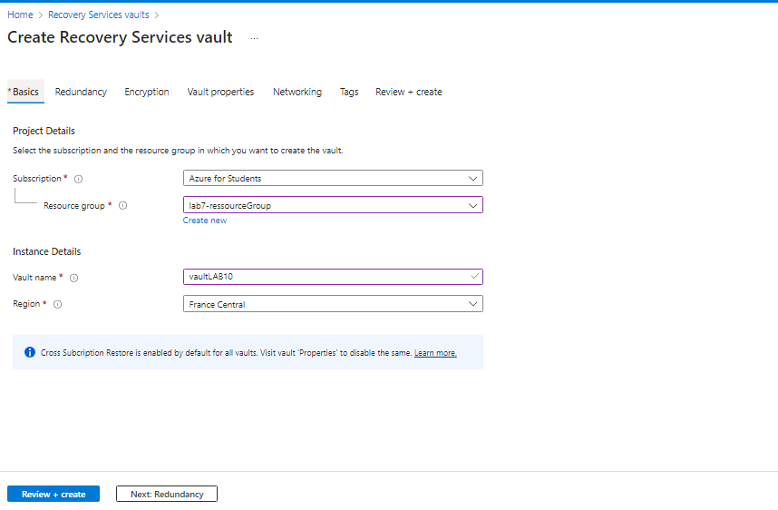

### Equivalent in Azure CLI
```bash
az backup vault create \
  --resource-group <YourResourceGroup> \
  --name <RecoveryVaultName> \
  --location <Region>
```

## 2. Configure Backup for VMs and Azure Files

### Azure Portal
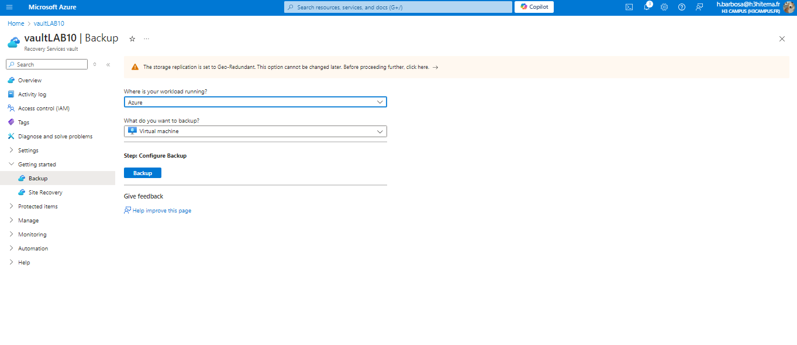
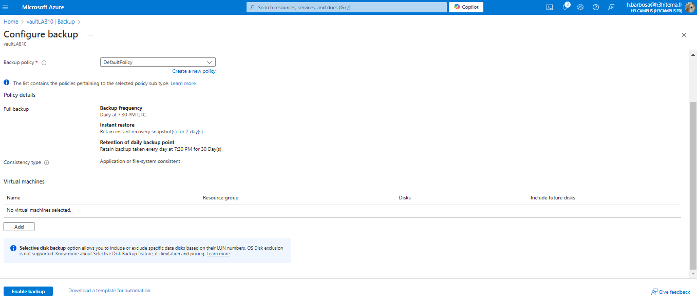
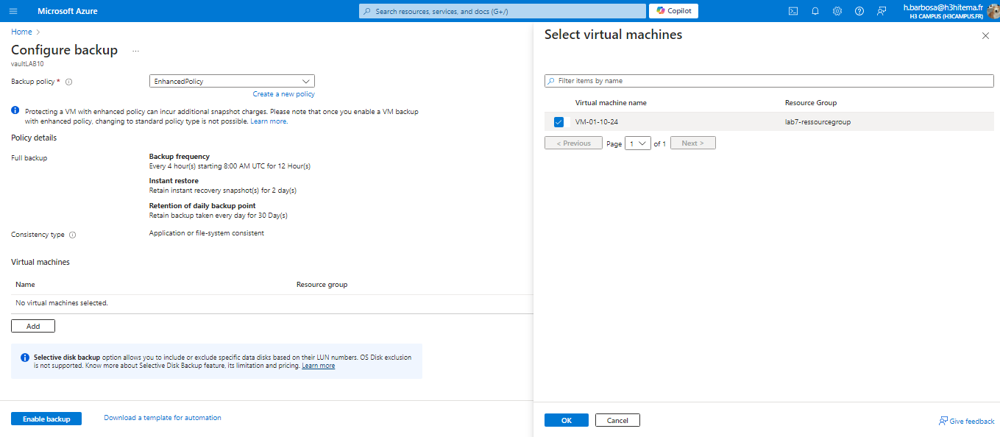


### Equivalent in Azure CLI
```bash
az backup protection enable-for-vm \
  --resource-group <YourResourceGroup> \
  --vault-name <RecoveryVaultName> \
  --vm <VMName> \
  --policy-name <BackupPolicyName>

az backup protection enable-for-azurefileshare \
  --resource-group <YourResourceGroup> \
  --vault-name <RecoveryVaultName> \
  --storage-account <StorageAccountName> \
  --azure-file-share <FileShareName> \
  --policy-name <BackupPolicyName>

```

## 3. Perform a Backup and Restore Operation

### Azure Portal
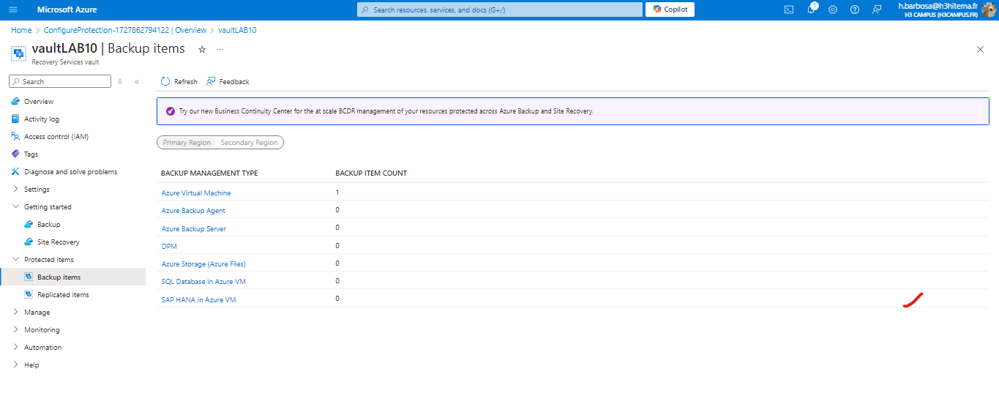
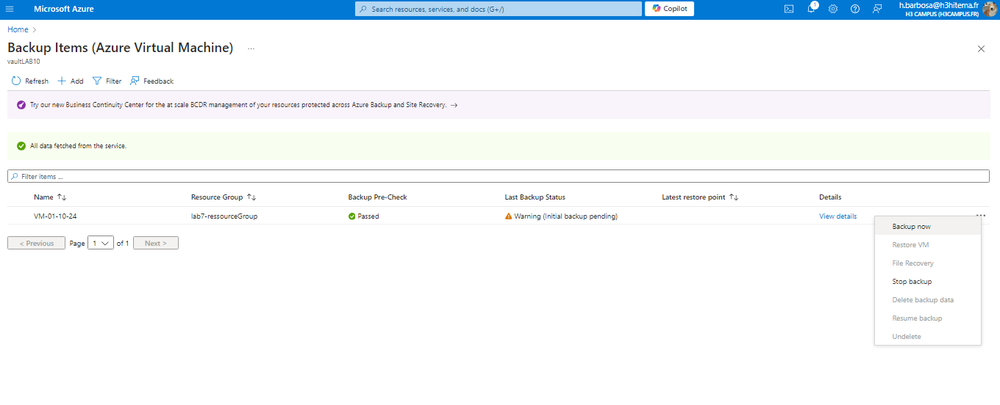
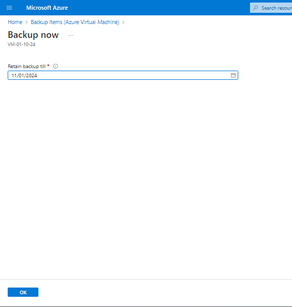

### Equivalent in Azure CLI
```bash
az backup protection backup-now \
  --resource-group <YourResourceGroup> \
  --vault-name <RecoveryVaultName> \
  --container-name <ContainerName> \
  --item-name <BackupItemName> \
  --retain-until <Date>

az backup restore restore-disks \
  --resource-group <YourResourceGroup> \
  --vault-name <RecoveryVaultName> \
  --container-name <ContainerName> \
  --item-name <BackupItemName> \
  --restore-to-staging-storage-account <StorageAccountName> \
  --target-resource-group <TargetResourceGroup>

```

## 4. Implement Backup Policies and Retention

### Azure Portal
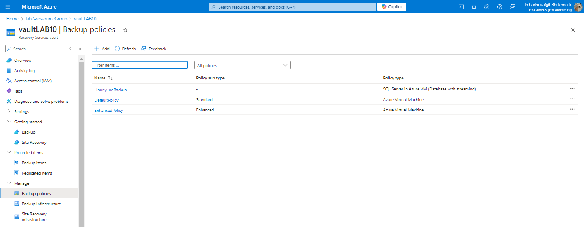
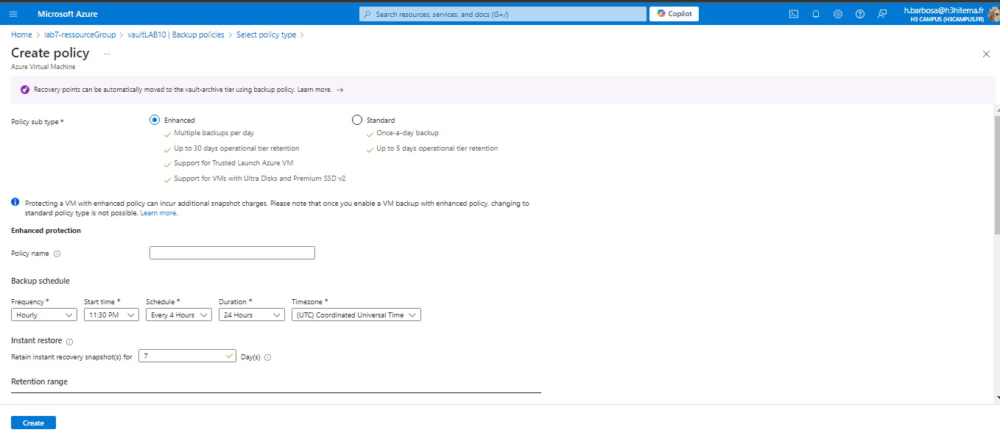
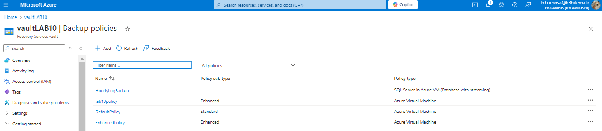

### Equivalent in Azure CLI
```bash
az backup policy create \
  --resource-group <YourResourceGroup> \
  --vault-name <RecoveryVaultName> \
  --name <BackupPolicyName> \
  --policy <PolicyFile>

```

