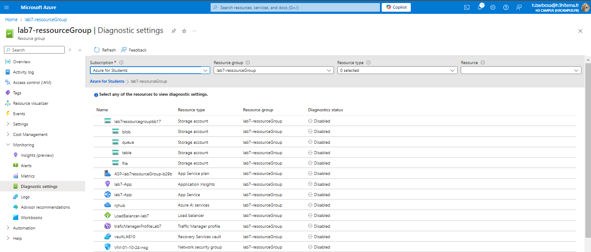
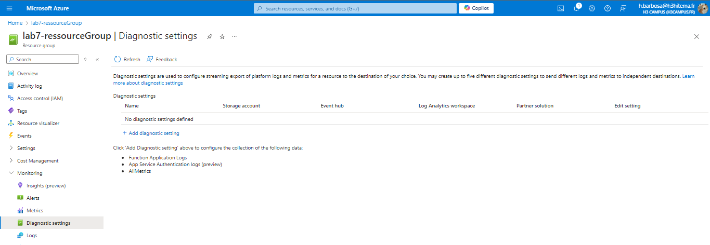
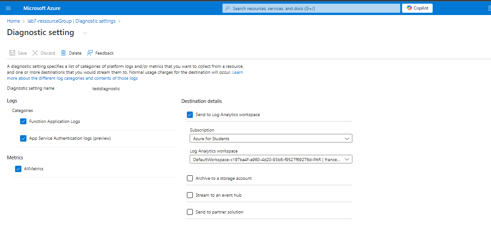
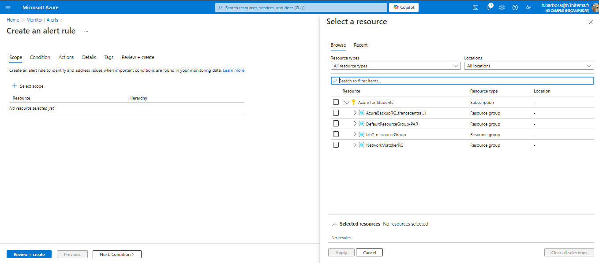
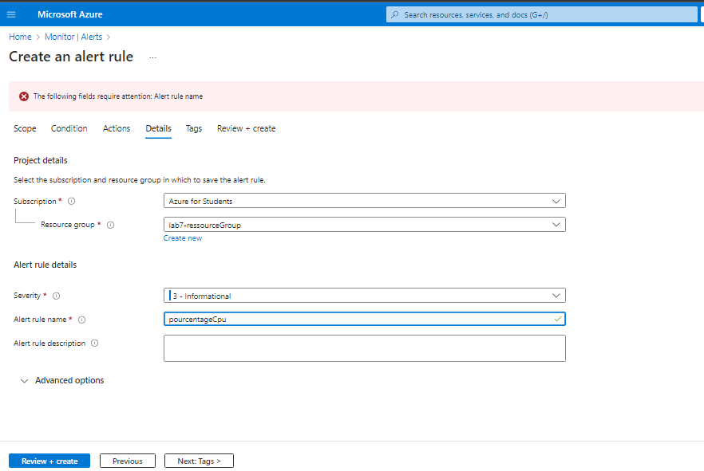
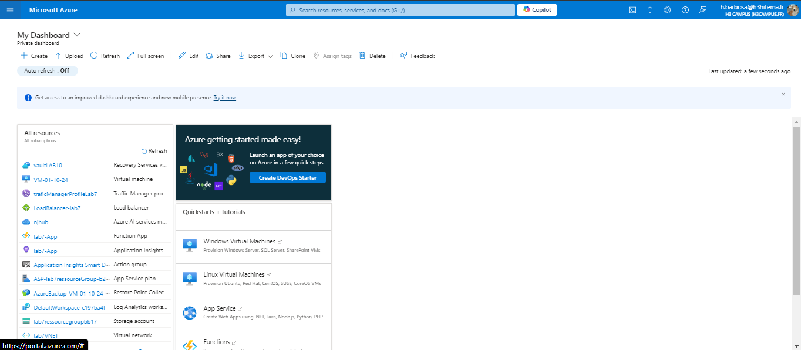
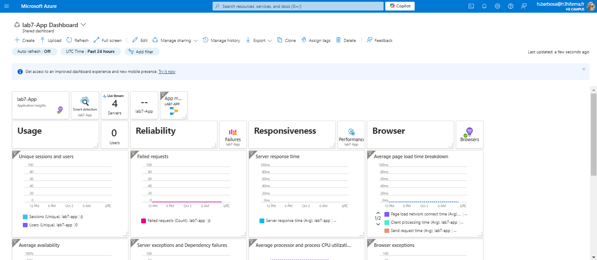
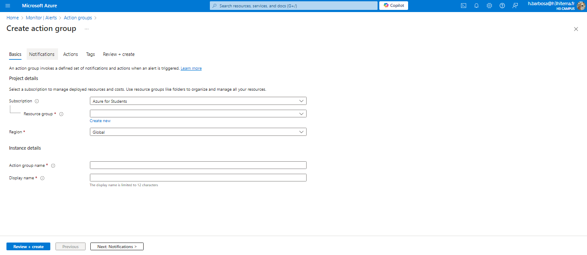
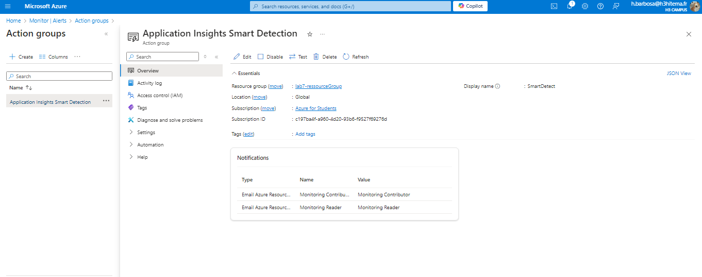

# Lab 11: Implementing Azure Monitor and Alerts

## 1. Set up Azure Monitor to Collect Metrics and Logs

### Azure Portal




### Equivalent in Azure CLI
```bash
# Enable diagnostic settings to collect metrics and logs
az monitor diagnostic-settings create \
  --resource <ResourceId> \
  --name <DiagnosticSettingName> \
  --metrics "[{'category': 'AllMetrics', 'enabled': true}]" \
  --logs "[{'category': 'Administrative', 'enabled': true}]"
```

## 2. Create Alerts Based on Resource Metrics

### Azure Portal



### Equivalent in Azure CLI
```bash
# Create an alert rule for high CPU usage
az monitor metrics alert create \
  --resource-group <ResourceGroup> \
  --name <AlertName> \
  --scopes <ResourceId> \
  --condition "avg Percentage CPU > 80" \
  --description "Alert when CPU usage exceeds 80%" \
  --action-group <ActionGroupId>

```

## 3. Visualize Data Using Azure Dashboards

### Azure Portal



### Equivalent in Azure CLI
```bash
# Example of creating a dashboard using an ARM template
az resource create \
  --resource-group <ResourceGroup> \
  --resource-type "Microsoft.Portal/dashboards" \
  --name <DashboardName> \
  --properties @dashboardTemplate.json
```

## 4. Implement Action Groups for Alert Notifications

### Azure Portal


### Equivalent in Azure CLI
```bash
# Create an Action Group
az monitor action-group create \
  --resource-group <ResourceGroup> \
  --name <ActionGroupName> \
  --action email <ActionName> <EmailAddress>
```
