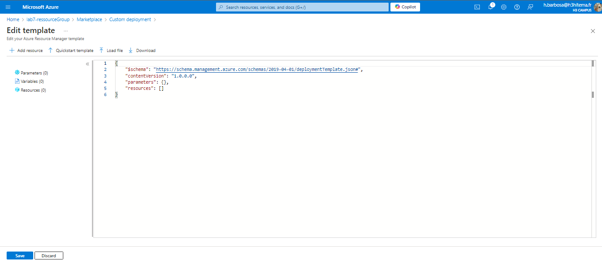

# Lab 12: Using Azure Resource Manager (ARM) Templates

## 1. Write an ARM Template to Deploy a Multi-Tier Application


### Template json

   ```json
   {
     "$schema": "https://schema.management.azure.com/schemas/2019-04-01/deploymentTemplate.json#",
     "contentVersion": "1.0.0.0",
     "parameters": {
       "vmName": {
         "type": "string",
         "metadata": {
           "description": "Name of the Virtual Machine"
         }
       }
     },
     "resources": [
       {
         "type": "Microsoft.Compute/virtualMachines",
         "apiVersion": "2021-03-01",
         "name": "[parameters('vmName')]",
         "location": "[resourceGroup().location]",
         "properties": {
           "hardwareProfile": {
             "vmSize": "Standard_DS1_v2"
           }
         }
       }
     ]
   }
```

```bash
az deployment group create \
  --resource-group <ResourceGroup> \
  --template-file template.json \
  --parameters vmName=<VMName>
```

## 2. Parameterize the Template for Reusability
In the ARM template editor, add parameters to your template to make it reusable.

### Template json

   ```json
"parameters": {
  "vmSize": {
    "type": "string",
    "defaultValue": "Standard_DS1_v2",
    "allowedValues": [
      "Standard_DS1_v2",
      "Standard_DS2_v2"
    ],
    "metadata": {
      "description": "Size of the Virtual Machine"
    }
  },
  "storageAccountType": {
    "type": "string",
    "defaultValue": "Standard_LRS",
    "allowedValues": [
      "Standard_LRS",
      "Premium_LRS"
    ],
    "metadata": {
      "description": "Type of Storage Account"
    }
  }
}

```

### Azure CLI

```bash
az deployment group create \
  --resource-group <ResourceGroup> \
  --template-file template.json \
  --parameters vmName=<VMName> vmSize=<VMSize> storageAccountType=<StorageType>
```

## 3. Deploy Resources Using the Template via Azure CLI
In the ARM template editor, add parameters to your template to make it reusable.

### Azure CLI

```bash
az deployment group create \
  --resource-group <ResourceGroup> \
  --template-file template.json \
  --parameters vmName=<VMName> vmSize=<VMSize> storageAccountType=<StorageType>
```

## 4. Validate and Troubleshoot Deployment Issues
Validate your ARM template before deployment

### Azure CLI
```bash
az deployment group validate \
  --resource-group <ResourceGroup> \
  --template-file template.json \
  --parameters vmName=<VMName> vmSize=<VMSize> storageAccountType=<StorageType>

az deployment group show \
  --resource-group <ResourceGroup> \
  --name <DeploymentName>

az deployment operation group list \
  --resource-group <ResourceGroup> \
  --name <DeploymentName>

```
