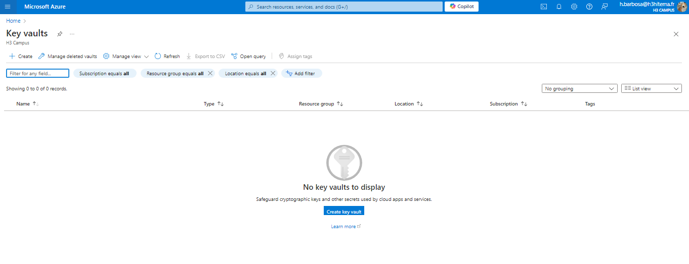
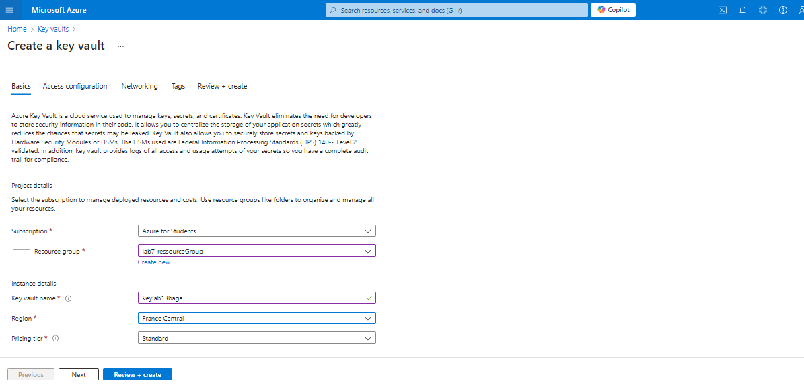
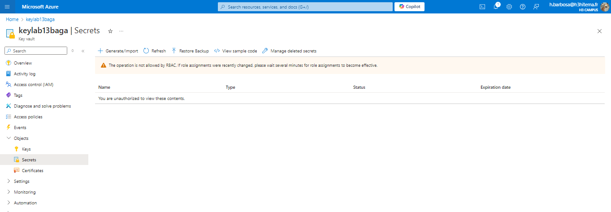
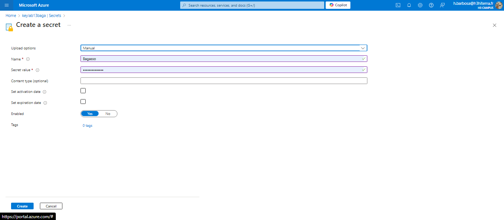
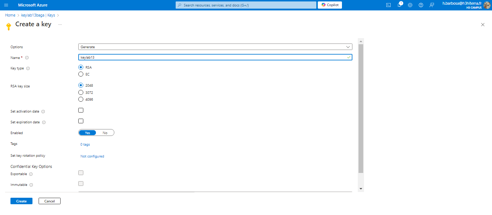

# Lab 13: Implementing Azure Key Vault

## 1. Create an Azure Key Vault

### Azure Portal



### Equivalent in Azure CLI
```bash
az keyvault create \
  --name <YourKeyVaultName> \
  --resource-group <YourResourceGroup> \
  --location <YourLocation> \
  --sku standard
```

## 2. Store and Retrieve Secrets, Keys, and Certificates
## Store a Secret
### Azure Portal



### Equivalent in Azure CLI
```bash
az keyvault secret set \
  --vault-name <YourKeyVaultName> \
  --name MySecret \
  --value "SuperSecretPassword"
```

## Retrieve a Secret

### Azure CLI

```bash
az keyvault secret show \
  --vault-name <YourKeyVaultName> \
  --name MySecret
```

## Store a Key
### Azure Portal


### Equivalent in Azure CLI

```bash
az keyvault secret show \
  --vault-name <YourKeyVaultName> \
  --name MySecret
```

## 3. Integrate Key Vault with an Application for Secret Management

### Azure Portal


### Equivalent in Azure CLI
```bash
az keyvault set-policy \
  --name <YourKeyVaultName> \
  --spn <YourServicePrincipalID> \
  --secret-permissions get list \
  --key-permissions get
```

exemple python
```python
from azure.identity import DefaultAzureCredential
from azure.keyvault.secrets import SecretClient

# Replace <YourKeyVaultName> with your Key Vault name
key_vault_url = f"https://<YourKeyVaultName>.vault.azure.net/"

credential = DefaultAzureCredential()
client = SecretClient(vault_url=key_vault_url, credential=credential)

retrieved_secret = client.get_secret("MySecret")

print(f"Retrieved secret: {retrieved_secret.value}")

```

## 4. Set Up Access Policies and Monitoring

### Azure Portal


### Equivalent in Azure CLI
```bash
# Setting access policy
az keyvault set-policy \
  --name <YourKeyVaultName> \
  --upn <YourUserPrincipalName> \
  --secret-permissions get list \
  --key-permissions get list

# Enable diagnostic settings
az monitor diagnostic-settings create \
  --resource-id $(az keyvault show --name <YourKeyVaultName> --query id -o tsv) \
  --name "keyvault-logs" \
  --logs '[{"category": "AuditEvent","enabled": true}]' \
  --workspace <YourLogAnalyticsWorkspaceID>

```

## 5. Try Using One of Your Keys Inside an Application

### Azure Portal


 example of how to sign or encrypt data using a key stored in the Key Vault in a Python application
```python
from azure.identity import DefaultAzureCredential
from azure.keyvault.keys import KeyClient
from azure.keyvault.keys.crypto import CryptographyClient, EncryptionAlgorithm

# Replace <YourKeyVaultName> with your Key Vault name
key_vault_url = f"https://<YourKeyVaultName>.vault.azure.net/"

credential = DefaultAzureCredential()
key_client = KeyClient(vault_url=key_vault_url, credential=credential)

# Retrieve the key
key = key_client.get_key("MyKey")

# Create cryptography client
crypto_client = CryptographyClient(key, credential)

# Encrypt data
data = b"Encrypt this message"
encrypt_result = crypto_client.encrypt(EncryptionAlgorithm.rsa_oaep, data)

print(f"Encrypted data: {encrypt_result.ciphertext}")
```