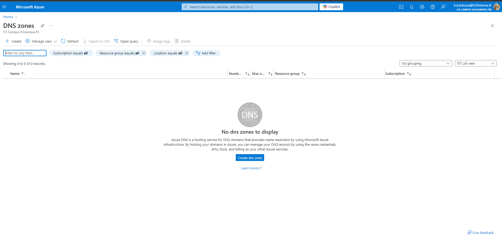
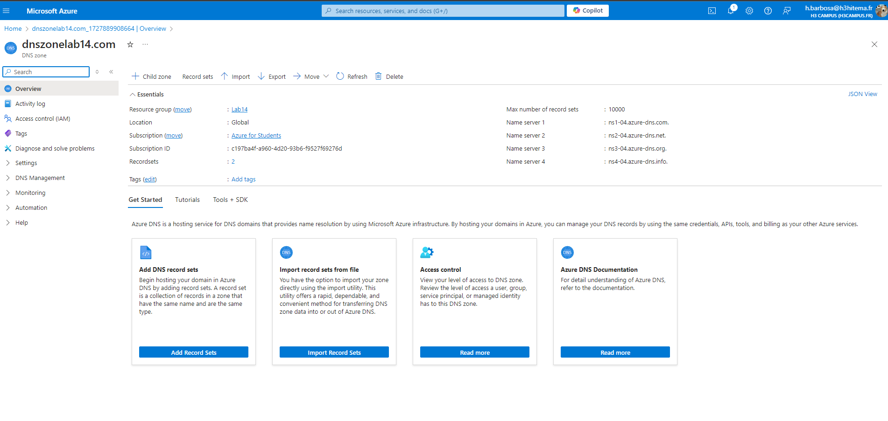
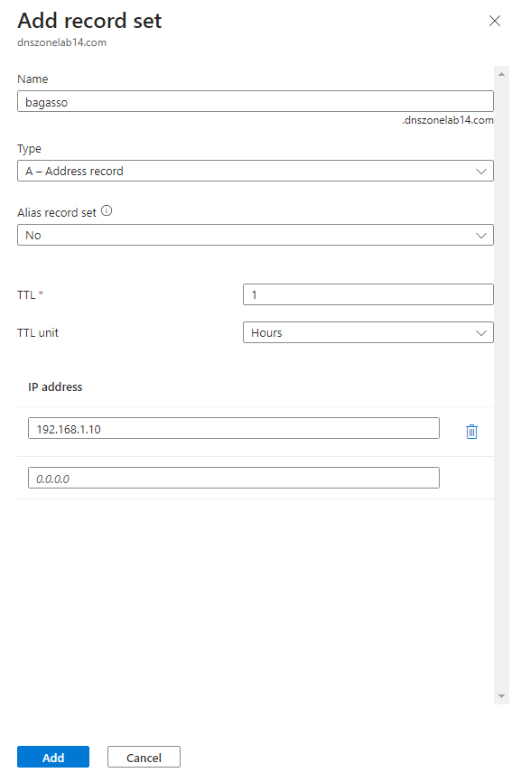
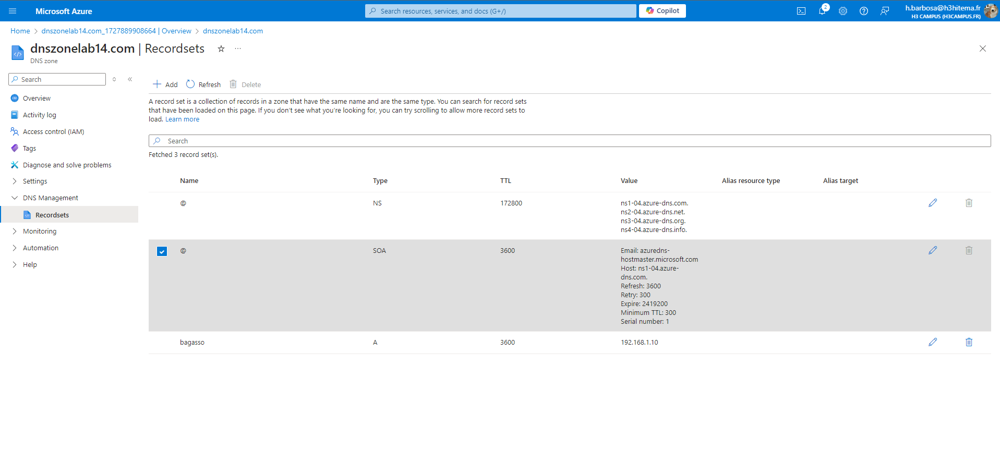
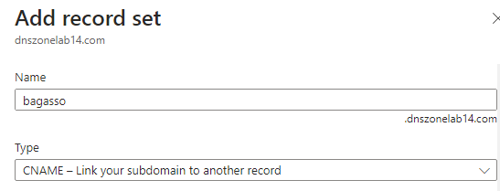

# Lab 14: Configuring Azure DNS and Custom Domains

## 1. Create an Azure DNS Zone

### Azure Portal



### Equivalent in Azure CLI
```bash
az network dns zone create \
  --resource-group <YourResourceGroup> \
  --name mydomain.com
```

## 2. Manage DNS Records for a Custom Domain

### Azure Portal



### Equivalent in Azure CLI
```bash
az network dns record-set a add-record \
  --resource-group <YourResourceGroup> \
  --zone-name mydomain.com \
  --record-set-name "@" \
  --ipv4-address <YourIPAddress>

  az network dns record-set cname set-record \
  --resource-group <YourResourceGroup> \
  --zone-name mydomain.com \
  --record-set-name www \
  --cname app.mydomain.com

```

## 3. Configure Domain Verification and Mapping for Azure Services

### Azure CLI
```bash
# Set a CNAME to verify domain ownership
az network dns record-set txt add-record \
  --resource-group <YourResourceGroup> \
  --zone-name mydomain.com \
  --record-set-name www \
  --value <VerificationToken>

# After adding the TXT record, map the custom domain to the app
az webapp config hostname add \
  --resource-group <YourResourceGroup> \
  --webapp-name <YourAppName> \
  --hostname www.mydomain.com
```

## 4. Implement DNS Aliases (CNAME) and Record Sets

### Azure Portal


### Equivalent in Azure CLI
```bash
az network dns record-set cname set-record \
  --resource-group <YourResourceGroup> \
  --zone-name mydomain.com \
  --record-set-name api \
  --cname <YourAzureServiceEndpoint>

az network dns record-set mx add-record \
  --resource-group <YourResourceGroup> \
  --zone-name mydomain.com \
  --exchange <mail.mydomain.com> \
  --preference 10

```