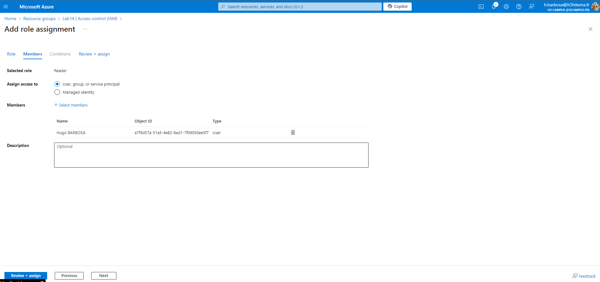
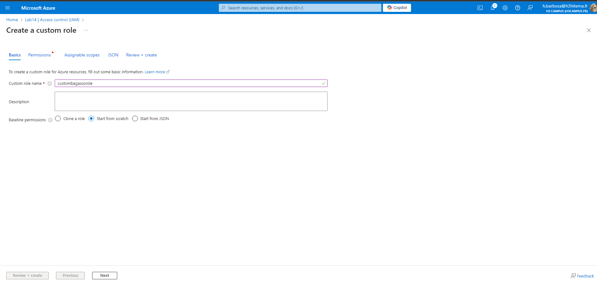
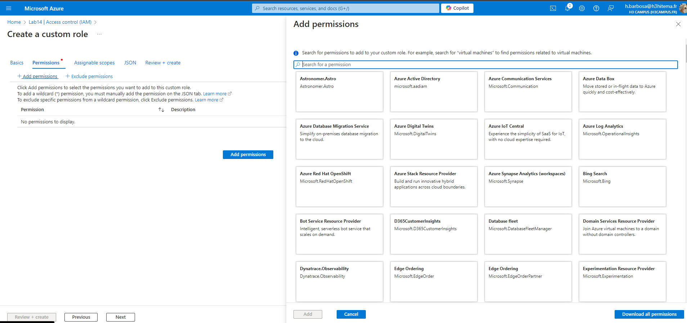
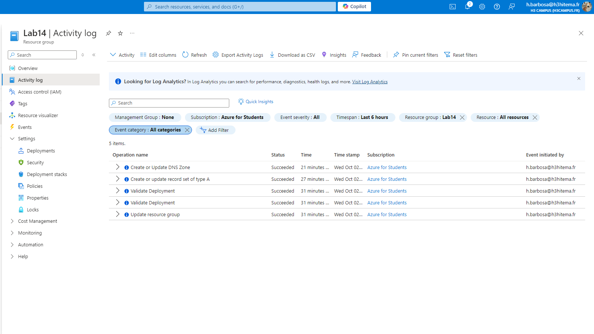

# Lab 16: Managing Role-Based Access Control (RBAC)

## 1. Assign Built-In Roles to Users and Groups

### Azure Portal


### Equivalent in Azure CLI
```bash
# Assign a built-in role to a user
az role assignment create \
  --role "<RoleName>" \
  --assignee "<UserEmail>" \
  --scope "/subscriptions/<SubscriptionID>/resourceGroups/<ResourceGroup>"
```

## 2. Create Custom Roles with Specific Permissions
EXEMPLE JSON FILE
```json
{
  "Name": "CustomRoleName",
  "IsCustom": true,
  "Description": "Custom role with specific permissions",
  "Actions": [
    "Microsoft.Compute/virtualMachines/start/action",
    "Microsoft.Compute/virtualMachines/deallocate/action"
  ],
  "NotActions": [],
  "AssignableScopes": [
    "/subscriptions/<SubscriptionID>"
  ]
}
```

### Azure Portal



### Equivalent in Azure CLI
```bash
az role definition create --role-definition customRole.json
```

## 3. Test Access Levels for Different Roles
* Navigate to the resource where you’ve assigned roles.
* Sign in with the user credentials of the assigned role (or impersonate the user).
* Verify if the user can perform the intended actions and confirm the restricted actions.
### Exemple Azure CLI
```bash
az login --username <UserEmail>
az vm start --name <VMName> --resource-group <ResourceGroup>
```

## 4. Audit Access Using Activity Logs

### Azure Portal


### Equivalent in Azure CLI
```bash
az monitor activity-log list \
  --resource-group <ResourceGroup> \
  --start-time <StartTime> \
  --end-time <EndTime> \
  --query "[].{Caller:caller, Action:operationName, Time:eventTimestamp}" \
  --output table
```