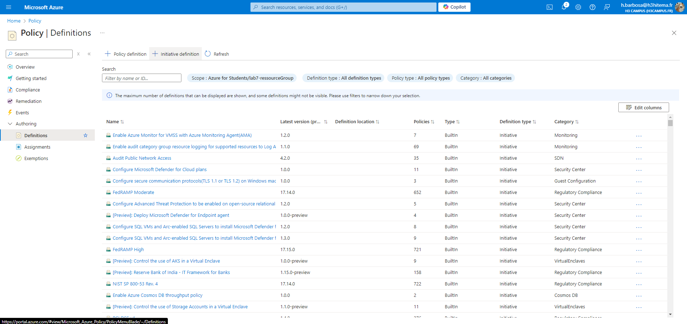
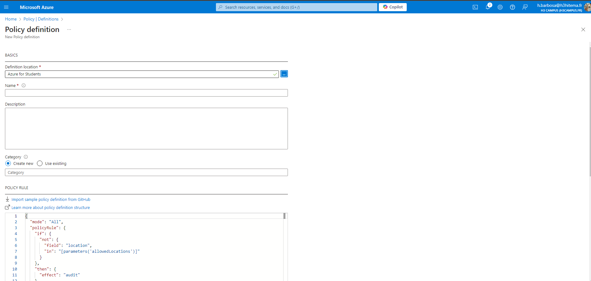
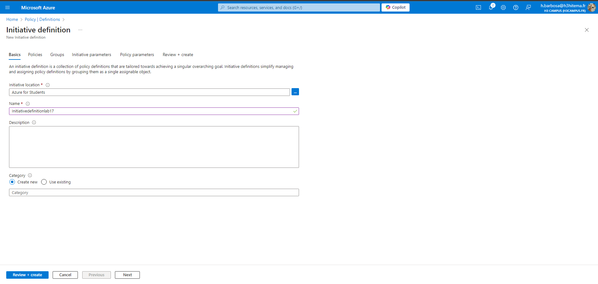
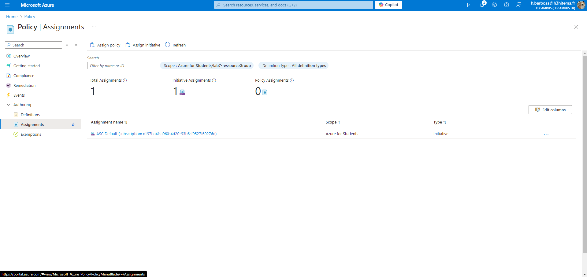
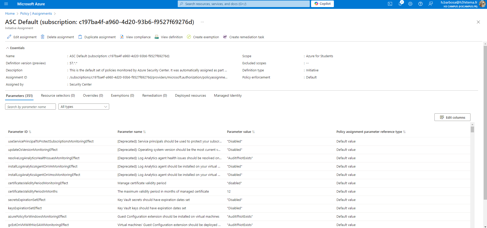

# Lab 17: Implementing Azure Policy and Governance

## 1. Create and Assign Azure Policies to Enforce Compliance

### Azure Portal



### Equivalent in Azure CLI
```bash
# Assign a built-in policy to restrict locations
az policy assignment create \
  --name "Allowed-Locations" \
  --policy "/providers/Microsoft.Authorization/policyDefinitions/<PolicyDefinitionID>" \
  --scope "/subscriptions/<SubscriptionID>/resourceGroups/<ResourceGroup>" \
  --params "{ \"listOfAllowedLocations\": { \"value\": [ \"East US\", \"West Europe\" ] } }"
```

## 2. Use Initiatives to Group Multiple Policies
Exemple JSON
```json
{
  "properties": {
    "displayName": "Security Initiative",
    "policyDefinitions": [
      {
        "policyDefinitionId": "/providers/Microsoft.Authorization/policyDefinitions/<PolicyDefinitionID1>",
        "parameters": {}
      },
      {
        "policyDefinitionId": "/providers/Microsoft.Authorization/policyDefinitions/<PolicyDefinitionID2>",
        "parameters": {}
      }
    ]
  }
}

```
### Azure Portal


### Equivalent in Azure CLI
```bash
az policy set-definition create --name "Security Initiative" --definitions initiative.json

```

## 3. Remediate Non-Compliant Resources

### Azure Portal



### Equivalent in Azure CLI
```bash
# Trigger remediation of non-compliant resources
az policy remediation create \
  --name "<RemediationName>" \
  --policy-assignment "<PolicyAssignmentID>" \
  --resource-group "<ResourceGroup>"
```

## 4. Analyze Compliance Reports
### Azure CLI
```bash
# List compliance results for a resource group
az policy state list \
  --resource-group "<ResourceGroup>" \
  --query "[].{Policy:'policyDefinitionId', Compliance:'complianceState'}" \
  --output table
```