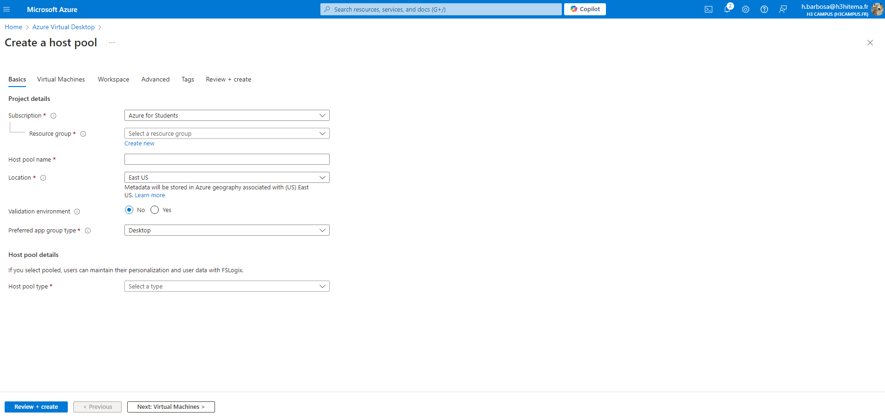
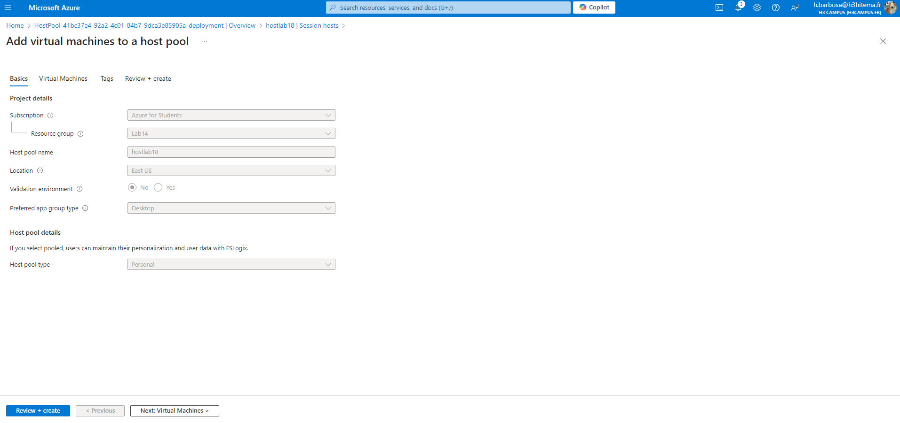
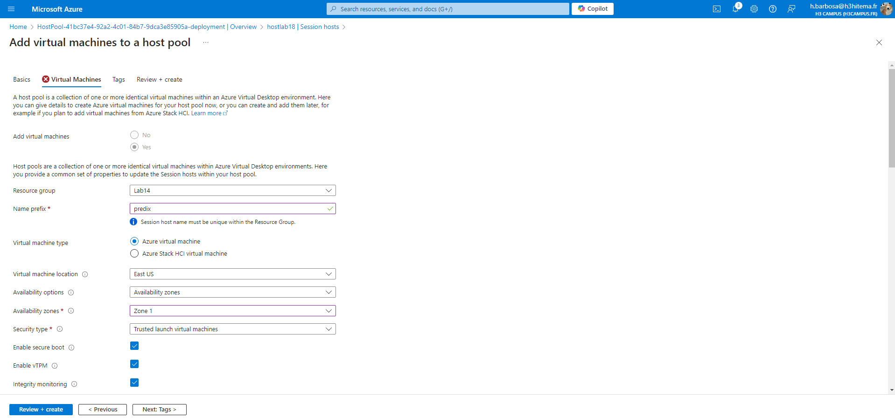

# Lab 18: Configuring Azure Virtual Desktop

## 1. Set up Azure Virtual Desktop Environment

### Azure Portal


### Equivalent in Azure CLI
```bash
# Create a resource group for AVD setup
az group create --name <ResourceGroupName> --location <Region>

# Create a virtual network for your AVD
az network vnet create \
  --name <VNetName> \
  --resource-group <ResourceGroupName> \
  --subnet-name <SubnetName> \
  --address-prefixes 10.0.0.0/16 \
  --subnet-prefix 10.0.1.0/24

# Create a host pool for the virtual desktop environment
az desktopvirtualization hostpool create \
  --resource-group <ResourceGroupName> \
  --name <HostPoolName> \
  --location <Region> \
  --validate \
  --friendly-name "MyHostPool" \
  --custom-rdp-property "audiocapturemode:i:1;"

# Create a workspace
az desktopvirtualization workspace create \
  --resource-group <ResourceGroupName> \
  --name <WorkspaceName> \
  --location <Region> \
  --description "AVD Workspace"
```
## 2. Configure Host Pools, Session Hosts, and Workspaces

### Azure Portal



### Equivalent in Azure CLI
```bash
# Create session hosts (virtual machines) and attach them to the host pool
az vm create \
  --resource-group <ResourceGroupName> \
  --name <SessionHostVMName> \
  --image Win2019Datacenter \
  --admin-username <AdminUsername> \
  --admin-password '<AdminPassword>' \
  --vnet-name <VNetName> \
  --subnet <SubnetName> \
  --size Standard_D2s_v3

# Add the session host to the host pool
az desktopvirtualization hostpool add \
  --resource-group <ResourceGroupName> \
  --name <HostPoolName> \
  --session-hosts <SessionHostVMName>

```

## 3. Publish Remote Desktop Applications
### Azure CLI
```bash
# Create an application group for remote apps
az desktopvirtualization applicationgroup create \
  --resource-group <ResourceGroupName> \
  --host-pool-name <HostPoolName> \
  --name <AppGroupName> \
  --location <Region> \
  --description "Application Group for AVD"

# Add a remote app to the application group
az desktopvirtualization application add \
  --resource-group <ResourceGroupName> \
  --application-group-name <AppGroupName> \
  --name "Notepad" \
  --app-id "notepad.exe"

```

## 4. Connect to the Virtual Desktops as a User
### Azure CLI
```bash
# Assign a user to a workspace
az desktopvirtualization workspace-user assign \
  --resource-group <ResourceGroupName> \
  --workspace-name <WorkspaceName> \
  --user-principal-name <UserEmail>

# List the available remote desktops and apps for a user
az desktopvirtualization workspace list \
  --resource-group <ResourceGroupName> \
  --workspace-name <WorkspaceName>
```