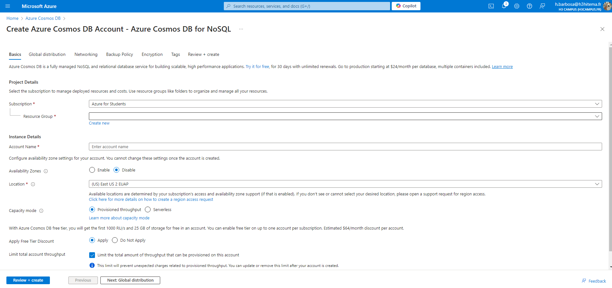

# Lab 19: Implementing Azure Cosmos DB

## 1. Create a Cosmos DB Account with a Chosen API (SQL, MongoDB, etc.)

### Azure Portal



### Equivalent in Azure CLI
```bash
# Create a Cosmos DB account with SQL API
az cosmosdb create \
  --name <CosmosDBAccountName> \
  --resource-group <ResourceGroupName> \
  --kind GlobalDocumentDB \
  --default-consistency-level Eventual \
  --locations regionName=<Region> failoverPriority=0 isZoneRedundant=False \
  --capabilities EnableServerless
```

## 2. Insert and Query Data Using the Data Explorer

### Azure Portal


### Equivalent in Azure CLI
```bash
# Create a Cosmos DB SQL database
az cosmosdb sql database create \
  --account-name <CosmosDBAccountName> \
  --resource-group <ResourceGroupName> \
  --name <DatabaseName>

# Create a Cosmos DB SQL container with a partition key
az cosmosdb sql container create \
  --account-name <CosmosDBAccountName> \
  --resource-group <ResourceGroupName> \
  --database-name <DatabaseName> \
  --name <ContainerName> \
  --partition-key-path "/id" \
  --throughput 400

# Insert data into the Cosmos DB container
az cosmosdb sql container item create \
  --account-name <CosmosDBAccountName> \
  --resource-group <ResourceGroupName> \
  --database-name <DatabaseName> \
  --container-name <ContainerName> \
  --body '{
    "id": "1",
    "name": "John Doe",
    "age": 30,
    "city": "Seattle"
  }'

# Query data (using a simple query example)
az cosmosdb sql query execute \
  --account-name <CosmosDBAccountName> \
  --resource-group <ResourceGroupName> \
  --database-name <DatabaseName> \
  --container-name <ContainerName> \
  --query "SELECT * FROM c WHERE c.city='Seattle'"

```

## 3. Configure Throughput and Partitioning

### Azure Portal


### Equivalent in Azure CLI
```bash
# Update the throughput for a Cosmos DB SQL container
az cosmosdb sql container throughput update \
  --account-name <CosmosDBAccountName> \
  --resource-group <ResourceGroupName> \
  --database-name <DatabaseName> \
  --container-name <ContainerName> \
  --throughput 1000
```

## 4. Implement Global Distribution

### Azure CLI
```bash
# Add a new region for global distribution
az cosmosdb update \
  --name <CosmosDBAccountName> \
  --resource-group <ResourceGroupName> \
  --locations regionName=<NewRegion> failoverPriority=1 isZoneRedundant=False
```