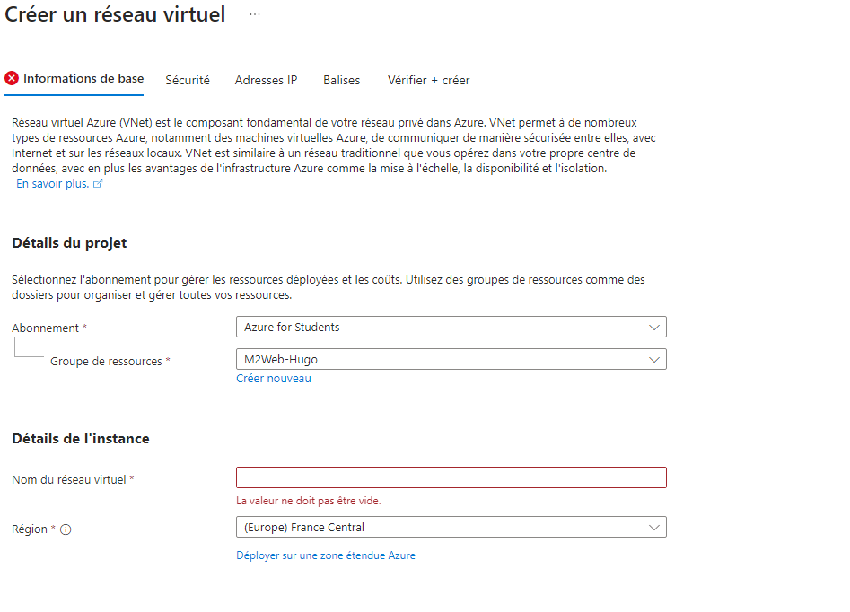
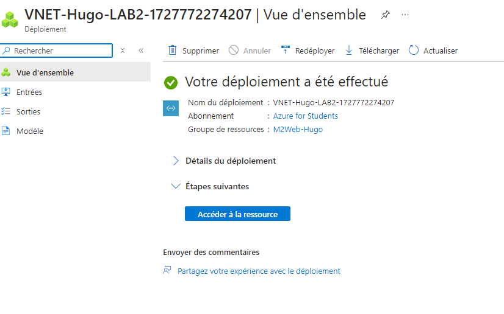
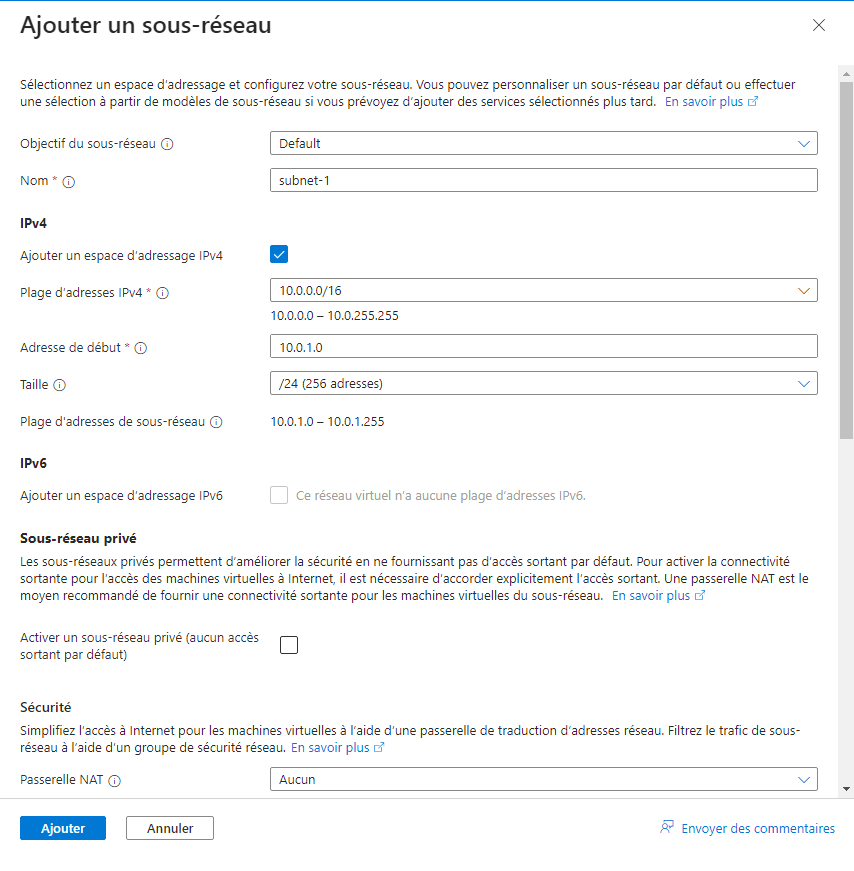
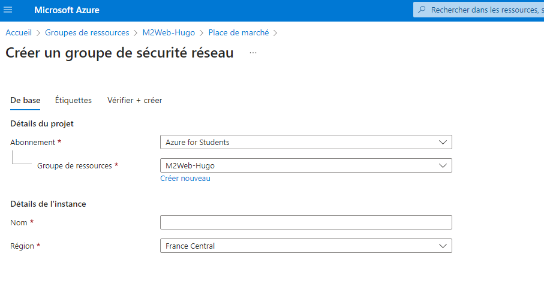
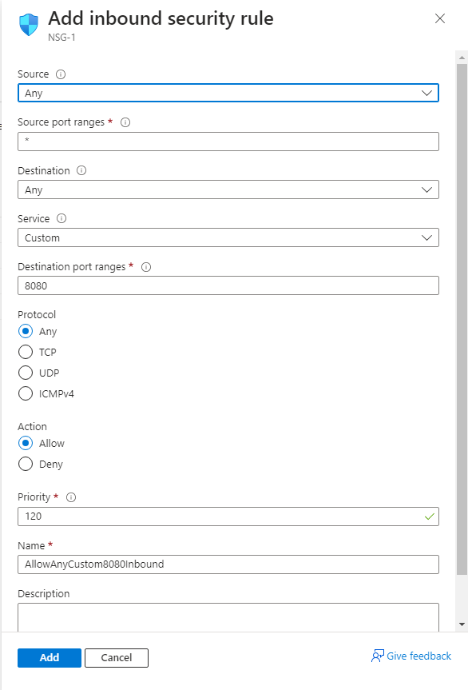
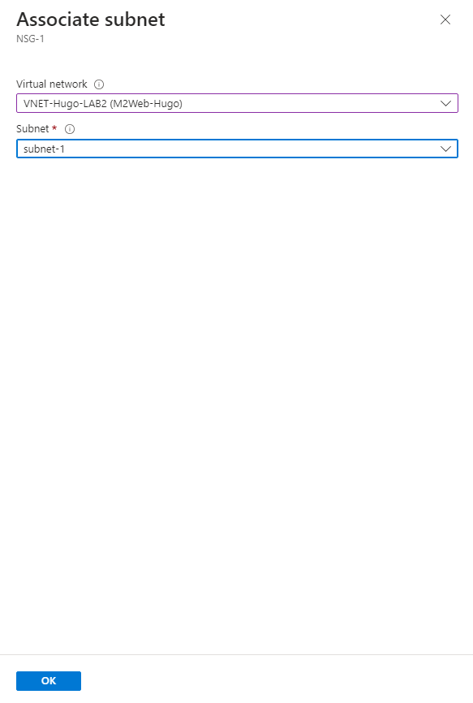
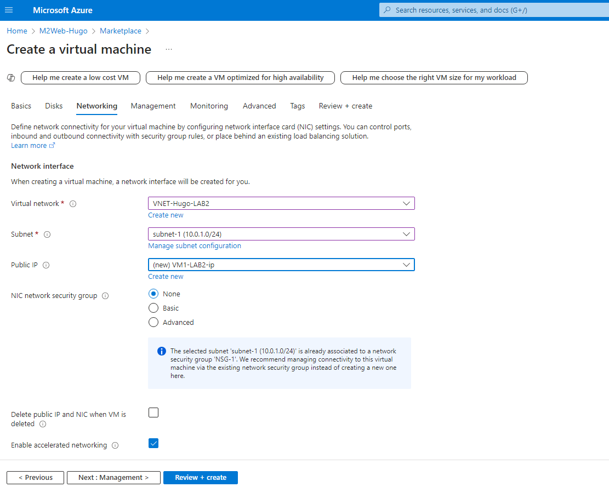
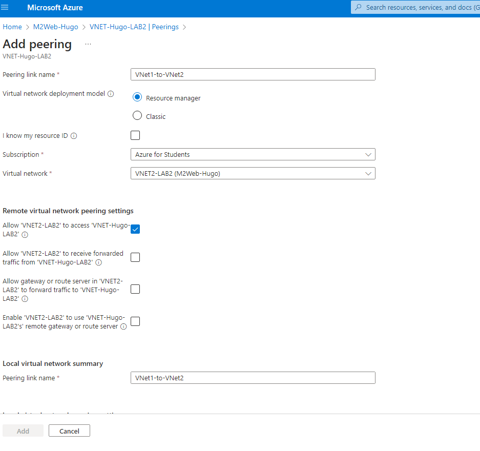

# Lab 2: Implementing Azure Virtual Networks

### Interface Azure

### Création d'un réseau virtuel




#### Équivalent en Azure CLI
```bash
az network vnet create \
  --resource-group <VotreResourceGroup> \
  --name <NomDuVNet> \
  --address-prefixes 10.0.0.0/16
``` 
### Ajout de sous réseau/x


#### Équivalent en Azure CLI
```bash
az network vnet subnet create \
  --resource-group <VotreResourceGroup> \
  --vnet-name <NomDuVNet> \
  --name Subnet1 \
  --address-prefix 10.0.1.0/24

az network vnet subnet create \
  --resource-group <VotreResourceGroup> \
  --vnet-name <NomDuVNet> \
  --name Subnet2 \
  --address-prefix 10.0.2.0/24
``` 
### Création d'un NSG(Network security group) ou Groupe de sécurité réseau


#### Équivalent en Azure CLI
```bash
az network nsg create \
  --resource-group <VotreResourceGroup> \
  --name NSG1
``` 
### Ouverture du port ssh(22) dans le groupe


#### Équivalent en Azure CLI
```bash
az network nsg rule create \
  --resource-group <VotreResourceGroup> \
  --nsg-name NSG1 \
  --name Allow-SSH \
  --protocol Tcp \
  --direction Inbound \
  --priority 100 \
  --source-address-prefixes '*' \
  --source-port-ranges '*' \
  --destination-address-prefixes '*' \
  --destination-port-ranges 22 \
  --access Allow
``` 
### Ajout d'un réseau et d'un sous réseau au NSG


#### Équivalent en Azure CLI
```bash
az network vnet subnet update \
  --resource-group <VotreResourceGroup> \
  --vnet-name <NomDuVNet> \
  --name Subnet1 \
  --network-security-group NSG1

az network vnet subnet update \
  --resource-group <VotreResourceGroup> \
  --vnet-name <NomDuVNet> \
  --name Subnet2 \
  --network-security-group NSG1
``` 
### Création d'une nouvelle VM que l'on vas déployer dans notre nouveau réseau virtuel


#### Équivalent en Azure CLI
```bash
  az vm create \
  --resource-group <VotreResourceGroup> \
  --name VM1 \
  --image UbuntuLTS \
  --admin-username <VotreNomUtilisateur> \
  --admin-password '<VotreMotDePasse>' \
  --vnet-name <NomDuVNet> \
  --subnet Subnet1 \
  --public-ip-address ""

az vm create \
  --resource-group <VotreResourceGroup> \
  --name VM2 \
  --image UbuntuLTS \
  --admin-username <VotreNomUtilisateur> \
  --admin-password '<VotreMotDePasse>' \
  --vnet-name <NomDuVNet> \
  --subnet Subnet2 \
  --public-ip-address ""
``` 
### Création d'un nouveau réseau virtuel(VNET2) puis peering entre les réseaux


#### Équivalent en Azure CLI
```bash
  az network vnet create \
  --resource-group <VotreResourceGroup> \
  --name VNet2 \
  --address-prefix 10.1.0.0/16 \
  --subnet-name Subnet1 \
  --subnet-prefix 10.1.1.0/24

az network vnet peering create \
  --resource-group <VotreResourceGroup> \
  --name VNet1-to-VNet2 \
  --vnet-name <NomDuVNet> \
  --remote-vnet VNet2 \
  --allow-vnet-access

az network vnet peering create \
  --resource-group <VotreResourceGroup> \
  --name VNet2-to-VNet1 \
  --vnet-name VNet2 \
  --remote-vnet <NomDuVNet> \
  --allow-vnet-access
``` 


