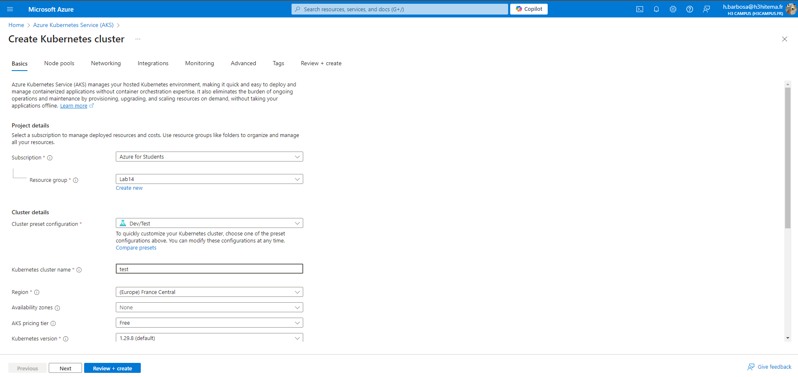
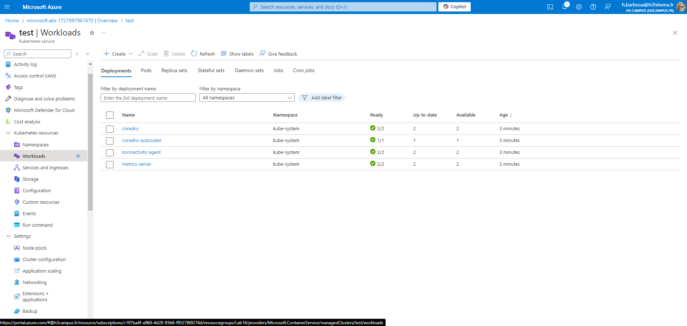

# Lab 20: Deploying Azure Kubernetes Service (AKS)

## 1. Set up an AKS Cluster

### Azure Portal


### Equivalent in Azure CLI
```bash
# Create an AKS cluster
az aks create \
  --resource-group <ResourceGroupName> \
  --name <AKSClusterName> \
  --node-count 3 \
  --enable-addons monitoring \
  --generate-ssh-keys
```

## 2. Deploy a Containerized Application Using Kubernetes Manifests
Exemple yaml
```yml
apiVersion: apps/v1
kind: Deployment
metadata:
  name: myapp
spec:
  replicas: 3
  selector:
    matchLabels:
      app: myapp
  template:
    metadata:
      labels:
        app: myapp
    spec:
      containers:
      - name: myapp
        image: <your_docker_image>
        ports:
        - containerPort: 80
```

### Azure CLI
```bash
# Get the AKS credentials to interact with the cluster
az aks get-credentials \
  --resource-group <ResourceGroupName> \
  --name <AKSClusterName>

# Deploy the Kubernetes manifests
kubectl apply -f <path_to_manifest.yml>
```

## 3. Scale Applications and Manage Pods

### Azure Portal


### Equivalent in Azure CLI
```bash
# Scale your Kubernetes deployment
kubectl scale deployment myapp --replicas=5

# Check the status of pods
kubectl get pods

# Delete or restart specific pods
kubectl delete pod <pod-name>
```

## 4. Implement Network Policies for Pod Communication
Exemple yaml
```yml
apiVersion: networking.k8s.io/v1
kind: NetworkPolicy
metadata:
  name: allow-specific-app
  namespace: default
spec:
  podSelector:
    matchLabels:
      app: myapp
  policyTypes:
  - Ingress
  ingress:
  - from:
    - podSelector:
        matchLabels:
          app: myapp
```
###  Azure CLI
```bash
# Apply the network policy
kubectl apply -f network-policy.yml
```