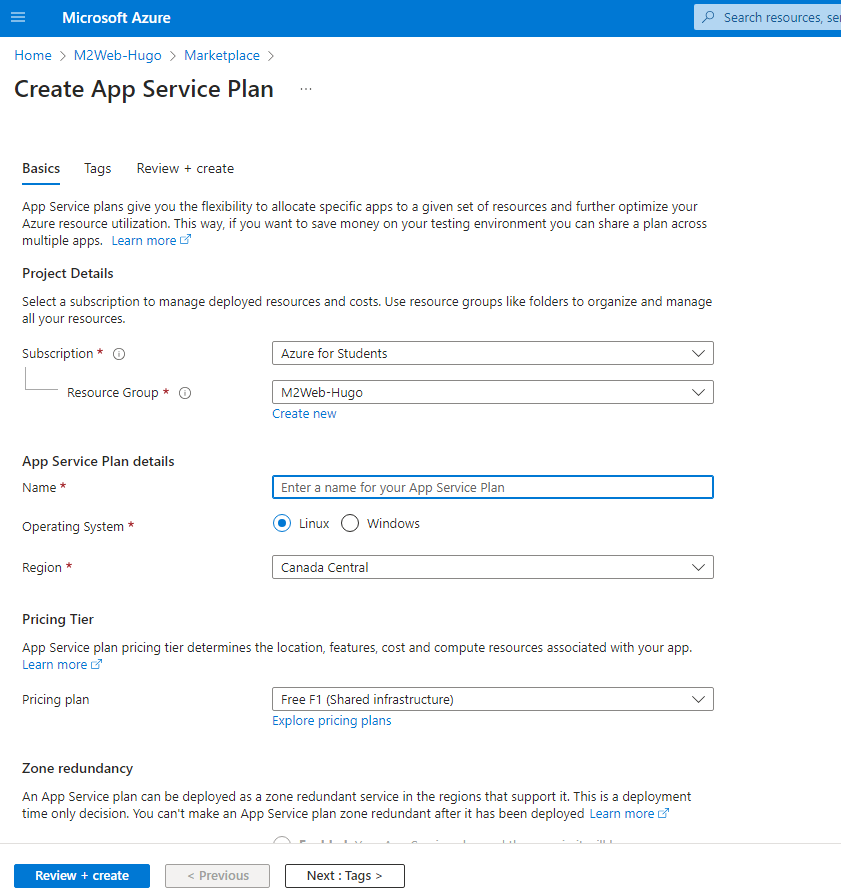
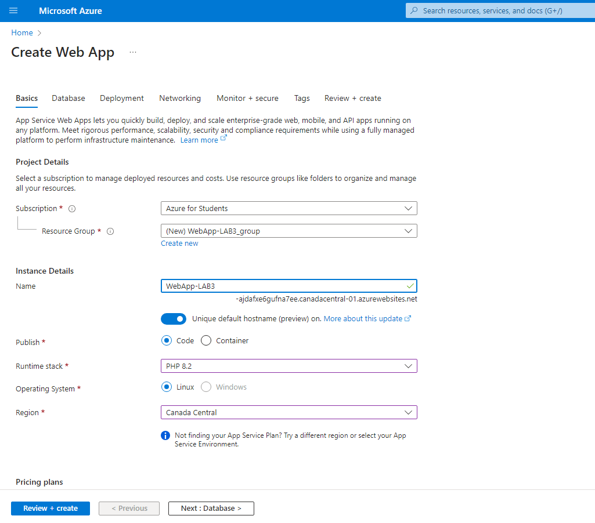
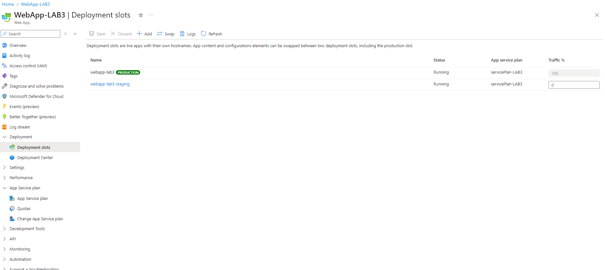

# Lab 3: Deploying Azure App Service Web Apps

### Interface Azure

#### 1. Créer un App Service plan
    

#### 2. Créer une Web App


#### 3. Configurer des domaines personnalisés et certificats SSL
Fail

#### 4. Implémenter des slots de déploiement pour le staging et la production


---

### Équivalent en Azure CLI

```bash
az appservice plan create \
  --name <NomDuPlan> \
  --resource-group <VotreResourceGroup> \
  --sku S1 --is-linux

az webapp create \
  --name <NomDeLApp> \
  --resource-group <VotreResourceGroup> \
  --plan <NomDuPlan> \
  --runtime "DOTNETCORE|3.1"

az webapp custom-domain add \
  --resource-group <VotreResourceGroup> \
  --name <NomDeLApp> \
  --hostname <VotreDomainePersonnalise>

az webapp ssl bind \
  --resource-group <VotreResourceGroup> \
  --name <NomDeLApp> \
  --certificate-name <NomDuCertificat> \
  --ssl-type SNI

az webapp deployment slot create \
  --name <NomDeLApp> \
  --resource-group <VotreResourceGroup> \
  --slot staging

az webapp deployment source config \
  --name <NomDeLApp> \
  --resource-group <VotreResourceGroup> \
  --slot staging \
  --repo-url <URLDuDepotGit> \
  --branch <NomDeLaBranche> \
  --manual-integration

az webapp deployment slot swap \
  --resource-group <VotreResourceGroup> \
  --name <NomDeLApp> \
  --slot staging


  
