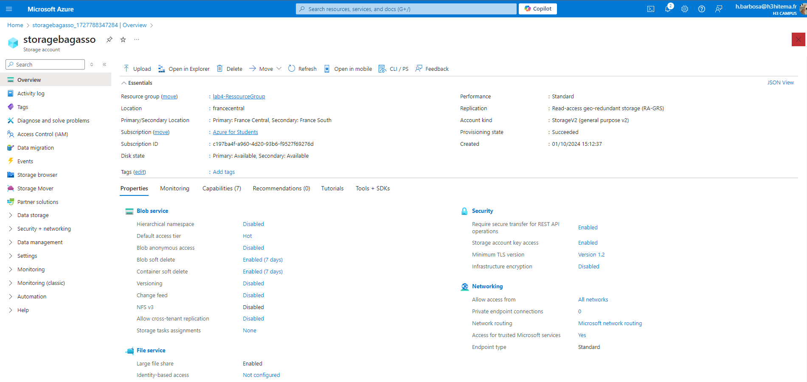
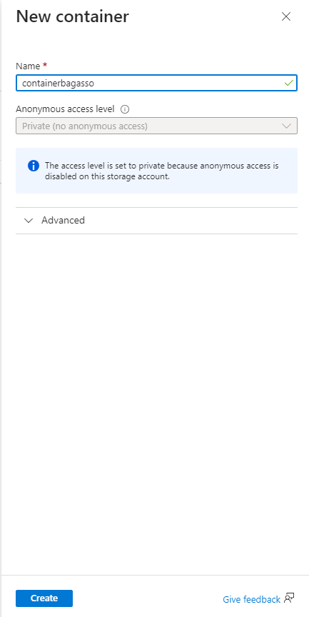
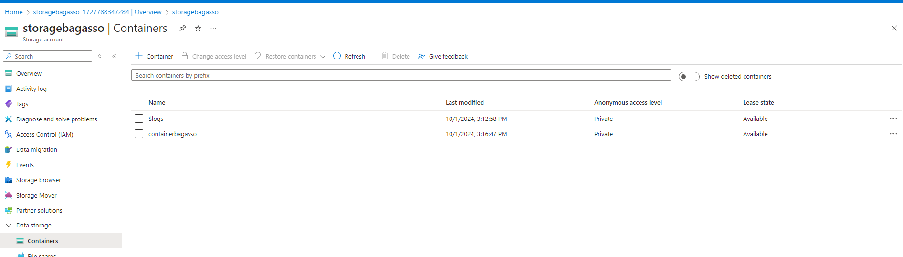
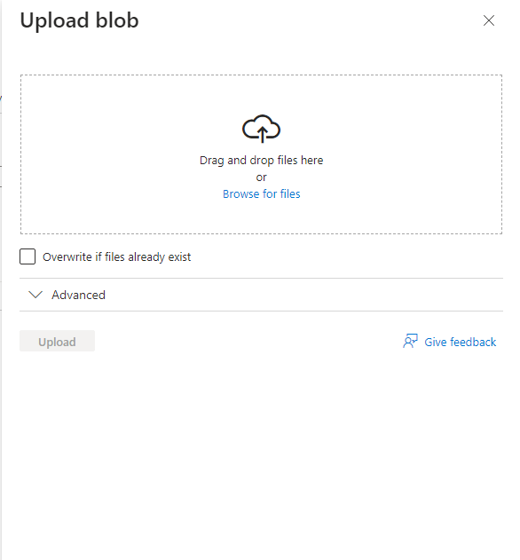
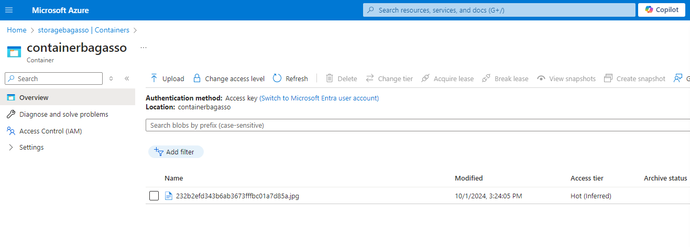
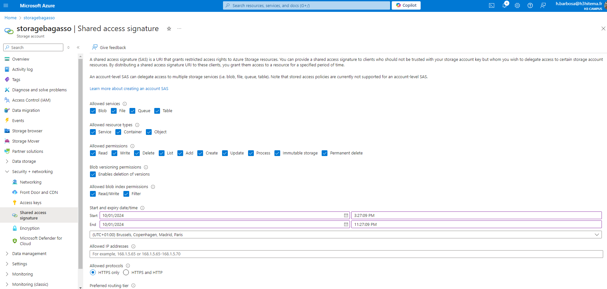
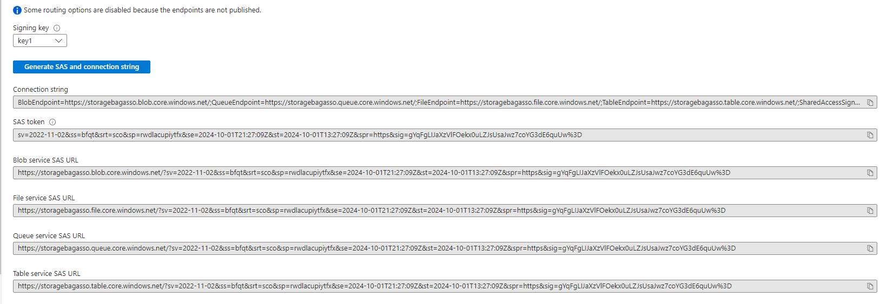
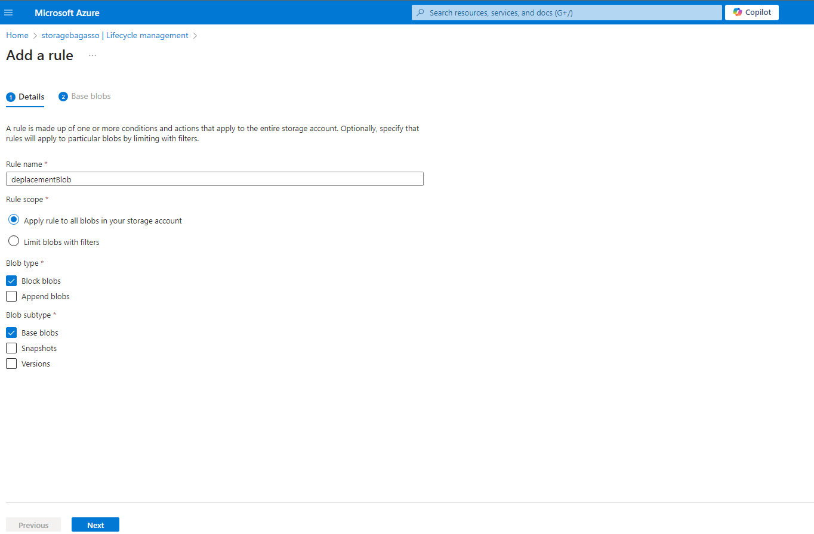
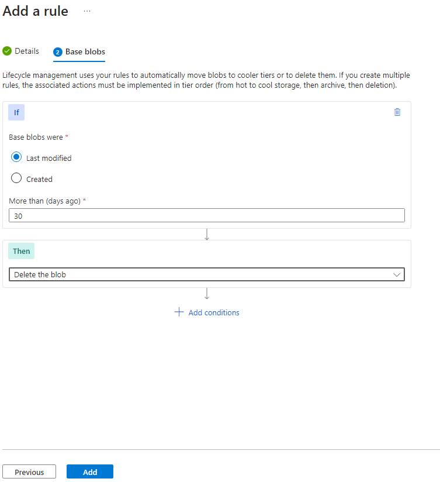

# Lab 4: Managing Azure Storage Accounts and Blobs

## 1. Création d'un compte de stockage

#### Interface Azure


#### Équivalent en Azure CLI
```bash
az storage account create \
  --name <NomDuCompteDeStockage> \
  --resource-group <VotreResourceGroup> \
  --location <VotreRegion> \
  --sku Standard_LRS # Ou remplacer par Standard_GRS, Standard_ZRS
```

## 2. Création d'un conteneur

#### Interface Azure



#### Équivalent en Azure CLI
```bash
az storage container create \
  --name <NomDuConteneur> \
  --account-name <NomDuCompteDeStockage>
```

## 3. Téléchargement d'un fichier blob

#### Interface Azure



#### Équivalent en Azure CLI
```bash
az storage blob upload \
  --container-name <NomDuConteneur> \
  --file <CheminDuFichierLocal> \
  --name <NomDuBlob> \
  --account-name <NomDuCompteDeStockage>
```

## 4. Configurer une signature d'accès partagé (SAS)

#### Interface Azure



#### Équivalent en Azure CLI
```bash
az storage account generate-sas \
  --account-name <NomDuCompteDeStockage> \
  --permissions rwdlacup \
  --services b \
  --resource-types co \
  --expiry <YYYY-MM-DDTHH:MMZ>
```

## 5. Configurer une signature d'accès partagé (SAS)

#### Interface Azure



#### Équivalent en Azure CLI
```bash
az storage account management-policy create \
  --account-name <NomDuCompteDeStockage> \
  --policy '{
    "rules": [
      {
        "name": "moveToCool",
        "enabled": true,
        "type": "Lifecycle",
        "definition": {
          "filters": {
            "blobTypes": ["blockBlob"],
            "prefixMatch": [""]
          },
          "actions": {
            "baseBlob": {
              "tierToCool": {
                "daysAfterModificationGreaterThan": 30
              }
            }
          }
        }
      }
    ]
  }'

```