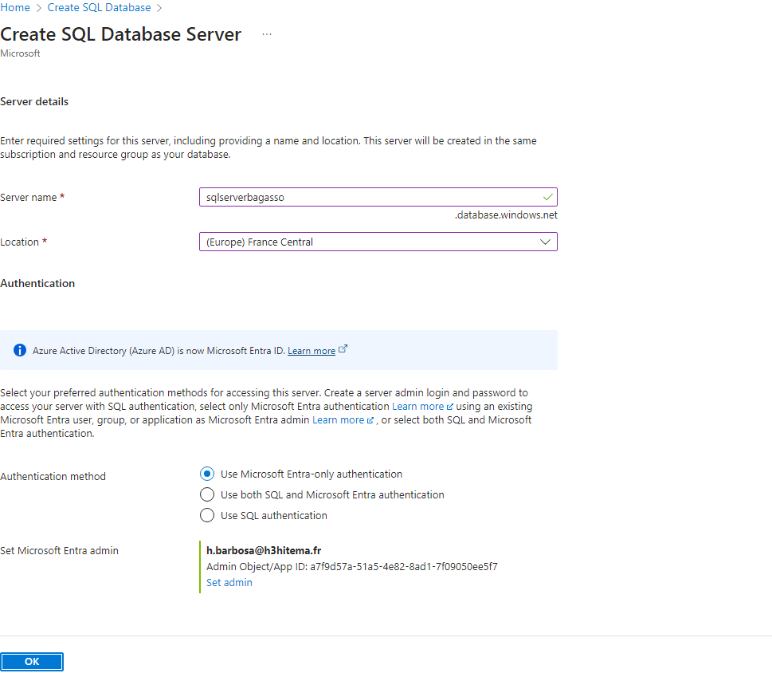
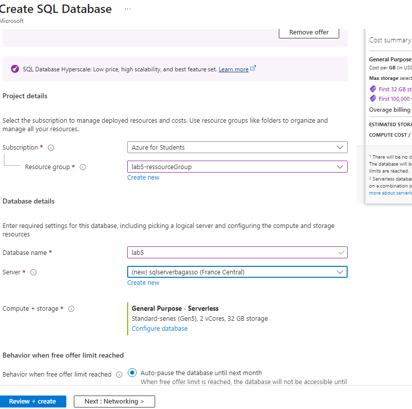
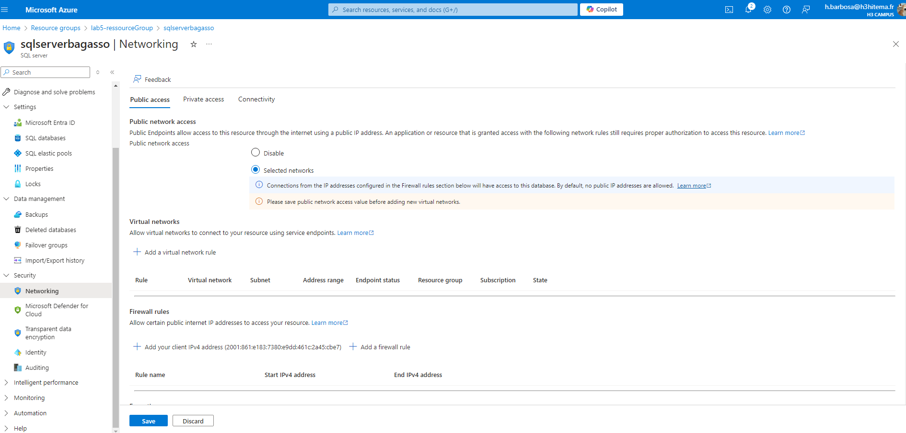
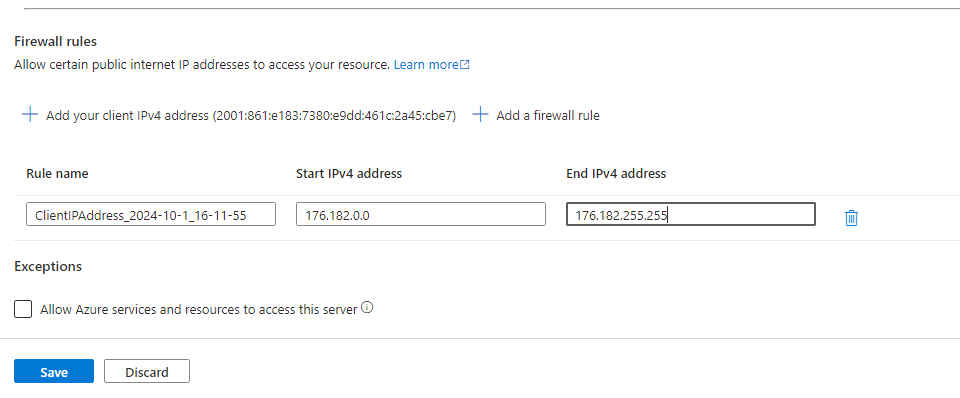
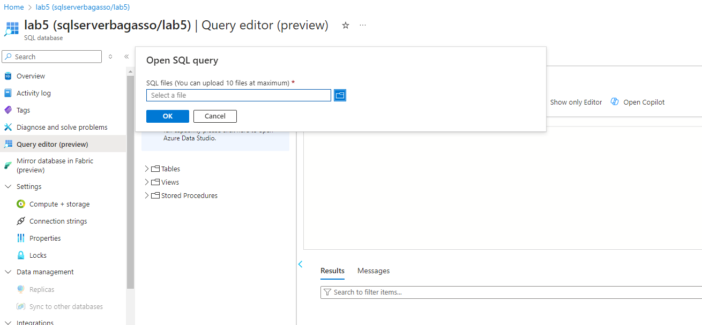

# Lab 5: Implementing Azure SQL Databases

## 1. Déploiement d'une instance de base de données Azure SQL

### Interface Azure



### Équivalent en Azure CLI
```bash
az sql server create \
  --name <NomDuServeurSQL> \
  --resource-group <VotreResourceGroup> \
  --location <Emplacement> \
  --admin-user <NomAdmin> \
  --admin-password '<VotreMotDePasse>'

az sql db create \
  --resource-group <VotreResourceGroup> \
  --server <NomDuServeurSQL> \
  --name <NomDeLaBaseDeDonnées> \
  --service-objective S0
```

## 2. Configuration des règles de pare-feu pour permettre l'accès des clients

### Interface Azure



### Équivalent en Azure CLI
```bash
az sql server firewall-rule create \
  --resource-group <VotreResourceGroup> \
  --server <NomDuServeurSQL> \
  --name AllowClientIP \
  --start-ip-address <AdresseIPClient> \
  --end-ip-address <AdresseIPClient>
```

## 3. Importation de données dans la base de données

### Interface Azure


### Équivalent en Azure CLI
```bash
az sql db import \
  --admin-user <NomAdmin> \
  --admin-password '<VotreMotDePasse>' \
  --storage-uri <URIduFichierBacpac> \
  --name <NomDeLaBaseDeDonnées> \
  --resource-group <VotreResourceGroup> \
  --server <NomDuServeurSQL>
```
