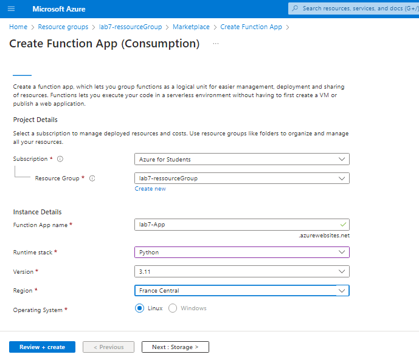
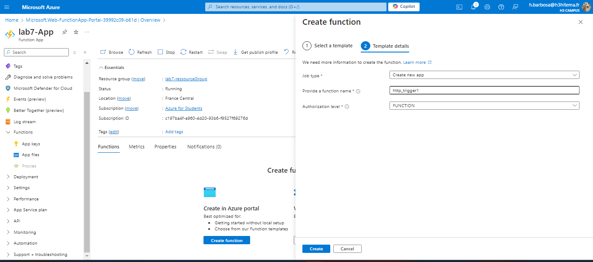
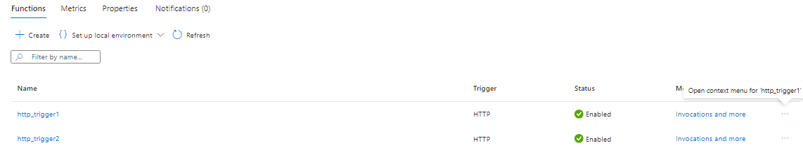
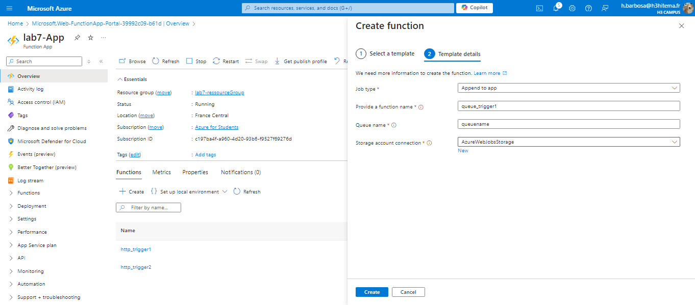
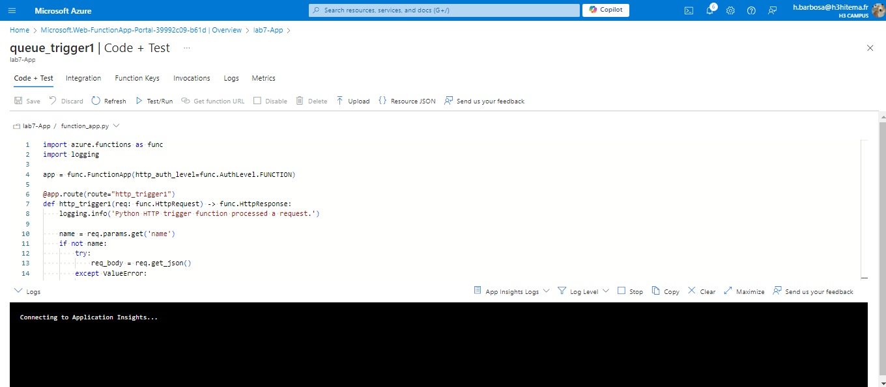
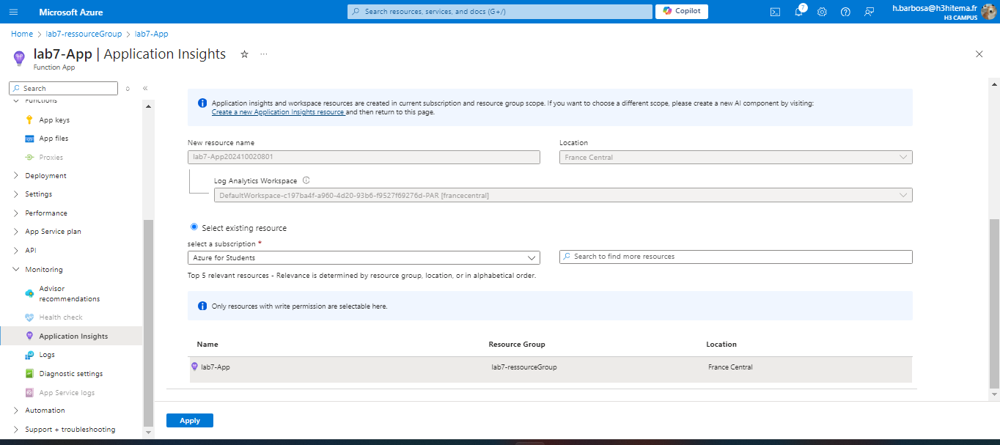

# Lab 7: Implementing Azure Functions

## 1. Création d'une Azure Function App

### Interface Azure


### Équivalent en Azure CLI
```bash
az functionapp create \
  --resource-group <VotreResourceGroup> \
  --consumption-plan-location <Emplacement> \
  --runtime <RuntimeStack> \
  --functions-version 4 \
  --name <NomDeLaFunctionApp> \
  --storage-account <NomDuCompteDeStockage>
  ```

## 2. Développement d'une fonction serverless déclenchée par une requête HTTP

### Interface Azure



### Équivalent en Azure CLI
```bash
az functionapp function create \
  --resource-group <VotreResourceGroup> \
  --function-app <NomDeLaFunctionApp> \
  --name <NomDeLaFonction> \
  --template "HttpTrigger" \
  --auth-level "function"

az functionapp function show \
  --resource-group <VotreResourceGroup> \
  --function-app <NomDeLaFunctionApp> \
  --name <NomDeLaFonction>

  ```

## 3. Intégration de la fonction avec Azure Storage ou Azure Queue

### Interface Azure



### Équivalent en Azure CLI
```bash
az storage queue create \
  --account-name <NomDuCompteDeStockage> \
  --name <NomDeLaFileDattente>

az functionapp function create \
  --resource-group <VotreResourceGroup> \
  --function-app <NomDeLaFunctionApp> \
  --name <NomDeLaFonctionQueue> \
  --template "QueueTrigger" \
  --storage-account <NomDuCompteDeStockage> \
  --auth-level "function"
  ```

## 4. Surveillance des performances et des journaux des fonctions

### Interface Azure


### Équivalent en Azure CLI
```bash
az monitor app-insights component create \
  --app <NomDeLApplicationInsights> \
  --location <Emplacement> \
  --resource-group <VotreResourceGroup>

az functionapp log show \
  --name <NomDeLaFunctionApp> \
  --resource-group <VotreResourceGroup>

  ```