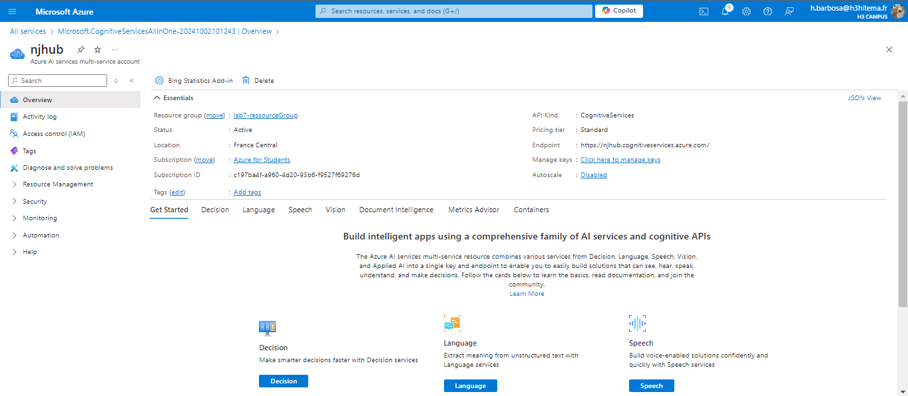
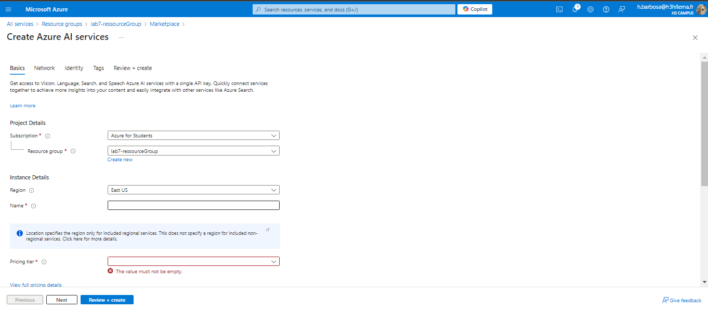
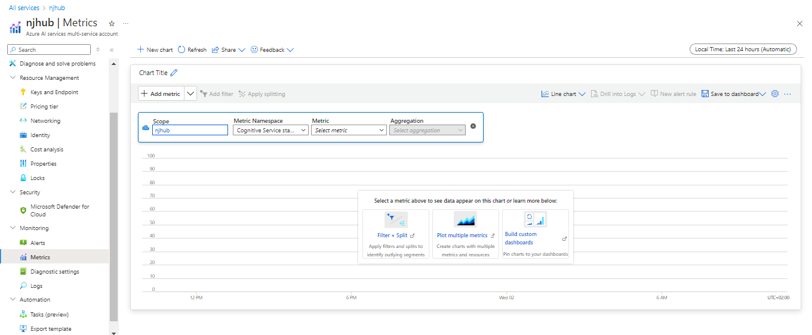
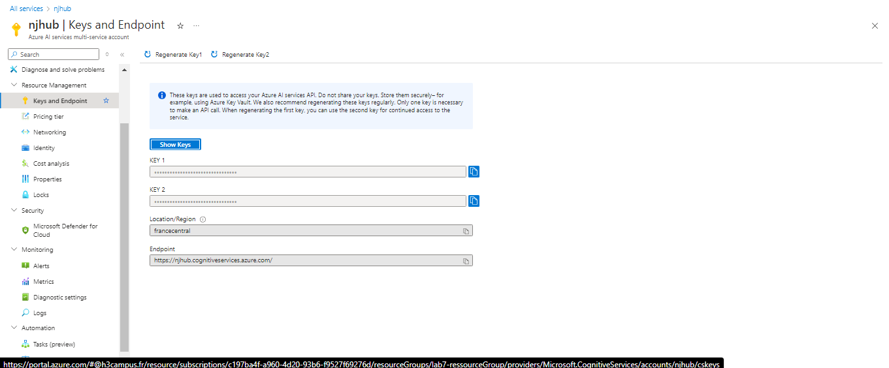

# Lab 8: Using Azure Cognitive Services

## 1. Create a Cognitive Services Resource

### Azure Portal



### Equivalent in Azure CLI
```bash
az cognitiveservices account create \
  --name <CognitiveServiceName> \
  --resource-group <YourResourceGroup> \
  --kind CognitiveServices \
  --sku S0 \
  --location <Location> \
  --yes
  ```

## 2. Develop an Application that Uses the Text Analytics API

In the left-hand menu, select Keys and Endpoint to get your API Key and Endpoint.
Use these credentials in your application to call the Text Analytics API.

### Code Python
```python
import requests

endpoint = "<YourCognitiveServiceEndpoint>"
key = "<YourAPIKey>"
path = "/text/analytics/v3.0/sentiment"

def analyze_sentiment(text):
    url = endpoint + path
    headers = {
        'Ocp-Apim-Subscription-Key': key,
        'Content-Type': 'application/json'
    }
    data = {
        "documents": [
            {"id": "1", "language": "en", "text": text}
        ]
    }
    response = requests.post(url, headers=headers, json=data)
    return response.json()

text = "I love programming with Azure!"
result = analyze_sentiment(text)
print(result)
  ```

## 3. Analyze Sentiment and Key Phrases from Sample Text

### Azure Portal
Indisponible

### Azure CLI
```bash
curl -X POST <YourCognitiveServiceEndpoint>/text/analytics/v3.0/sentiment \
    -H "Ocp-Apim-Subscription-Key: <YourAPIKey>" \
    -H "Content-Type: application/json" \
    -d '{
      "documents": [
        {
          "id": "1",
          "language": "en",
          "text": "Azure Cognitive Services are amazing!"
        }
      ]
    }'
  ```

## 4. Monitor API Usage and Manage Keys

### Azure Portal



### Equivalent in Azure CLI
```bash
az cognitiveservices account keys list \
  --name <CognitiveServiceName> \
  --resource-group <YourResourceGroup>

az cognitiveservices account keys regenerate \
  --name <CognitiveServiceName> \
  --resource-group <YourResourceGroup> \
  --key-name key1

az monitor metrics list \
  --resource <CognitiveServiceResourceID> \
  --metric-names TotalRequests,SuccessCount,FailureCount \
  --interval PT1H

  ```
