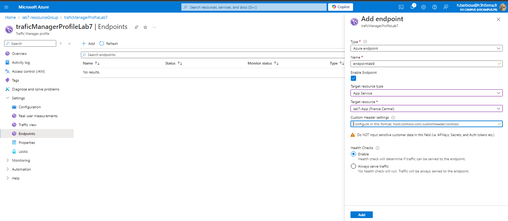

# Lab 9: Implementing Azure Load Balancer and Traffic Manager

## 1. Deploy Azure Load Balancer to Distribute Traffic Across VMs

### Azure Portal


### Equivalent in Azure CLI
```bash
az network lb create \
  --resource-group <YourResourceGroup> \
  --name <LoadBalancerName> \
  --sku Standard \
  --frontend-ip-name <FrontendName> \
  --public-ip-address <PublicIpName>
```

## 2. Configure Health Probes and Load Balancing Rules

### Azure Portal


### Equivalent in Azure CLI
```bash
az network lb probe create \
  --resource-group <YourResourceGroup> \
  --lb-name <LoadBalancerName> \
  --name <HealthProbeName> \
  --protocol Http \
  --port 80 \
  --path /

az network lb rule create \
  --resource-group <YourResourceGroup> \
  --lb-name <LoadBalancerName> \
  --name <LbRuleName> \
  --protocol Tcp \
  --frontend-port 80 \
  --backend-port 80 \
  --frontend-ip-name <FrontendName> \
  --backend-pool-name <BackendPoolName> \
  --probe-name <HealthProbeName>

```

## 3. Set up Azure Traffic Manager for DNS-based Traffic Routing

### Azure Portal




### Equivalent in Azure CLI
```bash
az network traffic-manager profile create \
  --resource-group <YourResourceGroup> \
  --name <TrafficManagerName> \
  --routing-method Performance \
  --unique-dns-name <UniqueDNSName>

az network traffic-manager endpoint create \
  --resource-group <YourResourceGroup> \
  --profile-name <TrafficManagerName> \
  --name <EndpointName> \
  --type azureEndpoints \
  --target-resource-id <ResourceID>

```

## 4. Test Failover Scenarios

In the Overview section, you can monitor the traffic flow to see if it's routing correctly to the active endpoint.
To test failover, stop one of the active endpoints, and Traffic Manager should automatically route traffic to the next available endpoint based on your routing method (e.g., Priority or Weighted).

### Equivalent in Azure CLI
```bash
az vm deallocate \
  --resource-group <YourResourceGroup> \
  --name <VMName>

az network traffic-manager profile show \
  --name <TrafficManagerName> \
  --resource-group <YourResourceGroup>


```
